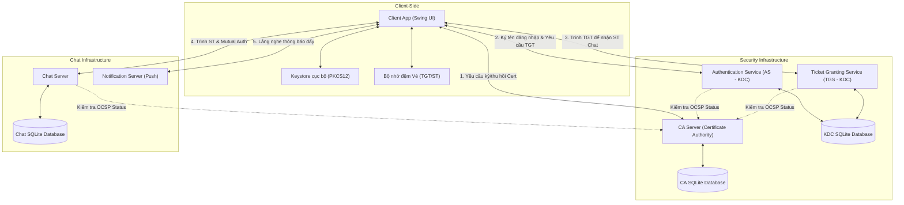
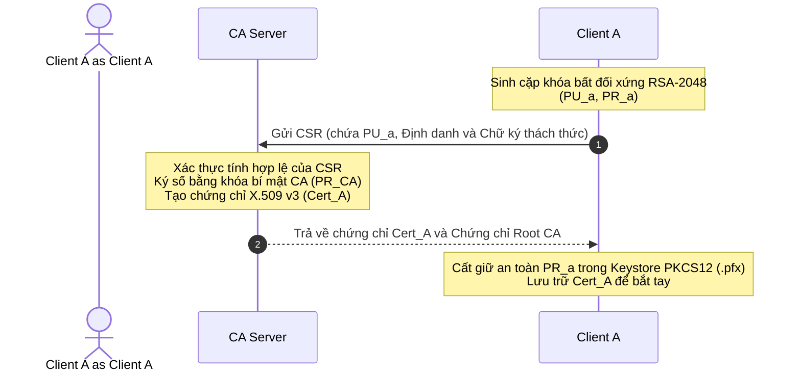
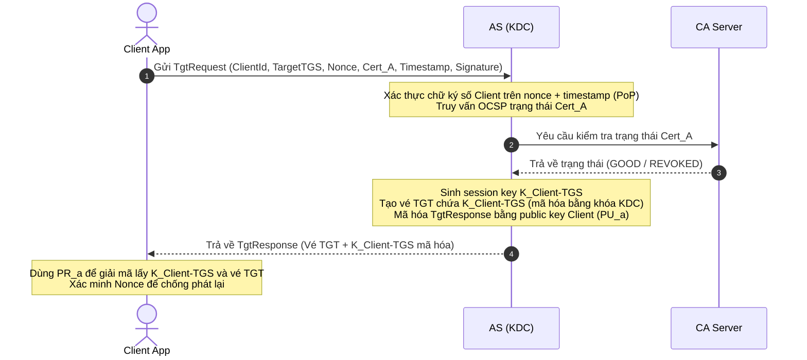
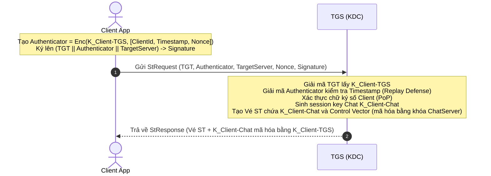
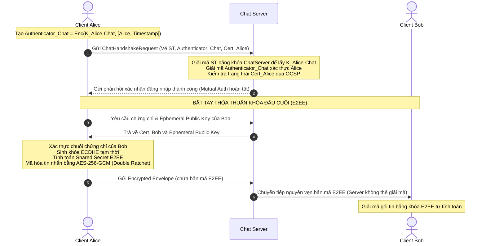

# BÁO CÁO KỸ THUẬT: HỆ THỐNG NHẮN TIN BẢO MẬT ĐẦU CUỐI (E2EE) SECURECHAT
> **Môn học:** Mã hóa Ứng dụng (CSC15003) - Giảng viên hướng dẫn: ThS. Mai Anh Tuấn.

---

## 1. Thông tin nhóm phát triển & Phân công nhiệm vụ

| STT | Họ và Tên | MSSV | Vai trò chính | Tỷ lệ đóng góp |
| :---: | :--- | :---: | :--- | :---: |
| 1 | **Gia Hiển** | 23120123 | Nhóm trưởng, Core Crypto, KDC, Shared-lib | 25% |
| 2 | **Anh Tuấn** | 23120184 | CA Server, PKI Workflow, OCSP | 25% |
| 3 | **Phú Thọ** | 23120169 | Chat Server, Network Protocol, Routing | 25% |
| 4 | **Trúc Ngọc** | 23120148 | UI/UX Swing, Client Integration, Testing | 25% |

### Bảng phân rã chi tiết công việc của các thành viên:

#### 1. Gia Hiển (23120123) - Nhóm trưởng, Core Cryptography & KDC Developer
*   **Thiết kế kiến trúc hệ thống:** Lên ý tưởng, định hình mô hình tương tác giữa Client - CA - KDC - Chat Server.
*   **Core Cryptography (shared-lib):** Xây dựng lõi mật mã đối xứng AES-256-GCM (đảm bảo tính bí mật và toàn vẹn), chữ ký số ECDSA (xác thực danh tính) và giao thức bắt tay trao đổi khóa Diffie-Hellman tạm thời (ECDHE) qua khóa Elliptic Curve.
*   **KDC Server (kdc-server):**
    *   **Cổng AS (Authentication Service):** Xác thực chữ ký số người dùng dựa trên mật khẩu và chứng chỉ số X.509, sinh session key tạm thời và cấp Vé nhận dạng (TGT).
    *   **Cổng TGS (Ticket Granting Service):** Xác thực TGT và Authenticator nhận được từ Client để cấp Vé dịch vụ (Service Ticket - ST) kết nối Chat Server.
*   **Cơ chế Chống Replay & Phân quyền:** Thiết kế cơ chế lọc Replay Attack sử dụng Nonce Cache kết hợp sai lệch Timestamp, tích hợp trường `Control Vector` vào ST để thực hiện phân quyền người dùng (Role-Based Access Control).

#### 2. Anh Tuấn (23120184) - PKI Infrastructure & CA Developer
*   **Thiết kế Root CA (ca-server):** Xây dựng hệ thống Certificate Authority để quản lý vòng đời chứng chỉ public key. Khởi tạo cặp private/public key ECDSA cho CA và sinh tệp chứng chỉ Root CA tự ký tin cậy.
*   **Certificate Authority Service:** Phát triển các API cho phép Client đăng ký tài khoản, gửi yêu cầu ký chứng chỉ số (CSR) và CA tự động cấp phát chứng chỉ định dạng X.509.
*   **OCSP Responder:** Triển khai dịch vụ xác thực trạng thái chứng chỉ số trực tuyến qua giao thức OCSP (Online Certificate Status Protocol) giúp các Server (KDC, Chat) kiểm tra trạng thái chứng chỉ của Client theo thời gian thực.
*   **Thu hồi chứng chỉ (Revocation System):** Xây dựng API gửi yêu cầu thu hồi (Revoke Request) kèm chữ ký số xác thực để hủy bỏ chứng chỉ khi người dùng bị lộ khóa bí mật hoặc thay đổi khóa.

#### 3. Phú Thọ (23120169) - Chat Infrastructure & Network Protocol Engineer
*   **Giao thức truyền dữ liệu (Network Protocol):** Định nghĩa cấu trúc khung gói tin `PacketFrame` để phân mảnh dữ liệu (Data Framing) bao gồm loại gói tin, mã hóa header, payload hỗ trợ truyền tin nhắn và gửi file dung lượng lớn.
*   **Chat Server (chat-server):** Thiết lập kết nối TCP Socket đa luồng (Multi-threading), quản lý các kết nối trực tuyến (Active Session), định tuyến tin nhắn, xử lý hàng đợi tin nhắn và tạo kênh chat đôi, chat nhóm.
*   **Notification Server (notification-server):** Xây dựng cổng dịch vụ đẩy thông báo sự kiện (Push Notification) thời gian thực tới Client (ví dụ: thông báo hệ thống, thông báo tin nhắn mới khi đang ở tab khác).
*   **Tích hợp OCSP Stapling:** Thiết kế cơ chế kẹp trạng thái chứng chỉ OCSP trực tiếp vào handshake TLS/SSL để tối ưu hóa hiệu năng, giảm tải truy vấn lặp đi lặp lại lên CA Server.

#### 4. Trúc Ngọc (23120148) - UI/UX Designer & Client Integration Tester
*   **Thiết kế Giao diện người dùng (client-app):** Thiết kế toàn bộ giao diện bằng Java Swing hiện đại theo phong cách Figma (Darkmode sang trọng, Layout chia cột 64/36, hiệu ứng tương tác nút bấm, khung chat động và thanh thông báo tiến trình hoạt động Activity Flow).
*   **Quản lý Khóa cục bộ & Client Crypto:** Tích hợp logic nạp/xuất private key từ tệp PKCS12 (`.pfx`) cục bộ tại Client, xây dựng cache quản lý vé tạm thời (Ticket Cache) tại Client để thực hiện Single Sign-On (SSO).
*   **Tính năng Truyền File E2EE:** Thiết kế giao diện và xử lý logic chia tệp tin thành các khối chunk 512KB, mã hóa từng chunk bằng AES-GCM với session key sinh ngẫu nhiên (Zero-Knowledge) trước khi gửi qua Chat Server.
*   **Kịch bản kiểm thử (JUnit Testing):** Xây dựng và thực thi 45 kịch bản kiểm thử tích hợp tự động kiểm tra tính chính xác của các thuật toán mã hóa, bắt tay Kerberos, xác thực OCSP và chống tấn công Replay.

---

## CHƯƠNG 1: ĐẶT VẤN ĐỀ

### 1.1. Sự bùng nổ của mạng diện rộng (WAN) và các rủi ro bảo mật cốt lõi
Trong kỷ nguyên kết nối internet toàn cầu, các giao dịch và thông tin truyền thông phần lớn đều đi qua các mạng diện rộng (WAN). Do bản chất của mạng WAN là tập hợp của vô số các nút mạng trung gian (routers, switch, nhà cung cấp dịch vụ ISP) không đáng tin cậy, dữ liệu truyền đi phải đối mặt với các nguy cơ an ninh nghiêm trọng:
*   **Nghe lén dữ liệu (Eavesdropping):** Kẻ tấn công sử dụng các công cụ bắt gói tin (packet sniffers) trên các đường truyền Wi-Fi công cộng hoặc các đường cáp trung gian để thu thập toàn bộ dữ liệu dưới dạng văn bản rõ (plaintext).
*   **Tấn công xen giữa (Man-in-the-Middle - MITM):** Kẻ tấn công giả danh các thực thể hợp lệ (như giả mạo Router hoặc Server dịch vụ) để can thiệp vào luồng dữ liệu, đánh cắp session key hoặc thay đổi nội dung tin nhắn mà người dùng không hề hay biết.
*   **Tấn công phát lại (Replay Attack):** Hacker thu thập các gói tin chứa vé xác thực hợp lệ trên mạng truyền dẫn, sau đó phát lại (replay) các gói tin này lên máy chủ để chiếm quyền truy cập trái phép mà không cần biết thông tin đăng nhập.
*   **Nghịch lý xác thực (Authentication Paradox):** Việc yêu cầu người dùng nhập mật khẩu lặp đi lặp lại qua mạng để truy cập các dịch vụ khác nhau làm tăng nguy cơ lộ mật khẩu qua đường truyền hoặc tạo cơ hội cho các cuộc tấn công brute-force trực tuyến.

### 1.2. Vấn đề "Server Trust" trong các ứng dụng chat hiện đại
Phần lớn các phần mềm nhắn tin phổ biến hiện nay sử dụng mô hình mã hóa đường truyền (Transport Layer Security - TLS/SSL).
*   **Hạn chế của TLS/SSL đơn thuần:** Dữ liệu chỉ được mã hóa trong quá trình di chuyển từ Client đến Server. Khi đến máy chủ trung tâm, dữ liệu bắt buộc phải được giải mã để xử lý hoặc lưu trữ trong CSDL của nhà cung cấp dịch vụ.
*   **Rủi ro Server Trust:** Nếu máy chủ trung tâm bị tấn công, hoặc có nhân viên quản trị cố tình xem lén, toàn bộ lịch sử trò chuyện của hàng triệu người dùng sẽ bị lộ.
*   **Giải pháp Zero-Trust & E2EE:** Để triệt tiêu rủi ro này, hệ thống bắt buộc phải áp dụng triết lý thiết kế Zero-Trust - không tin tưởng bất kỳ thành phần nào nằm ngoài hai người dùng cuối. Điều này đòi hỏi dữ liệu phải được **mã hóa đầu cuối (E2EE)** trực tiếp từ máy người gửi và chỉ có thể giải mã tại máy người nhận hợp lệ.

### 1.3. Bài toán quản lý và phân phối khóa mật mã
Theo **Nguyên lý Kerckhoffs**, độ an toàn của một hệ thống mật mã phụ thuộc hoàn toàn vào việc giữ bí mật khóa chứ không nằm ở việc giữ bí mật thuật toán. Do đó, bài toán quản lý và phân phối khóa trở thành thách thức lớn nhất trong E2EE:
*   **Bùng nổ số lượng khóa:** Trong một mạng gồm $N$ người dùng, nếu chỉ sử dụng mã hóa khóa đối xứng truyền thống để mỗi cặp người dùng có một khóa riêng, tổng số khóa cần quản lý và phân phối sẽ tăng theo hàm lũy thừa:
    $$K = \frac{N \times (N - 1)}{2} = O(N^2)$$
    Khi số lượng người dùng lên tới hàng ngàn hoặc hàng triệu, việc lưu trữ và phân phối an toàn lượng khóa đối xứng khổng lồ này qua kênh truyền không an toàn là điều không khả thi.
*   **Sự cần thiết của KDC và PKI:** Hệ thống cần một thực thể trung gian đáng tin cậy để phân phối session key động và xác thực nguồn gốc public key mà không làm bùng nổ số lượng khóa cần quản lý ở thiết bị đầu cuối.

---

## CHƯƠNG 2: GIẢI PHÁP KIẾN TRÚC: KẾT HỢP KERBEROS V5 VÀ PKI

### 2.1. Hạn chế của Kerberos V5 truyền thống
Giao thức Kerberos V5 là một trong những chuẩn xác thực và phân phối khóa kinh điển trong mạng máy tính. Tuy nhiên, kiến trúc Kerberos V5 gốc tồn tại một số điểm yếu chí mạng khi áp dụng vào môi trường internet hiện đại:
*   **Vấn đề lưu trữ mật mã tập trung tại KDC:** Kerberos truyền thống yêu cầu Trung tâm phân phối khóa (KDC) phải lưu trữ secret key dài hạn (Symmetric Long-term Key) của mọi thực thể, khóa này được phái sinh trực tiếp từ mật khẩu của người dùng. Do đó, KDC vô tình trở thành một "kho mật khẩu mật" tập trung. Nếu cơ sở dữ liệu của KDC bị tấn công hoặc quản trị viên hệ thống có hành vi gian lận, toàn bộ hệ thống sẽ lập tức sụp đổ.
*   **Sự thiếu linh hoạt trong đăng ký mới:** Khi một người dùng mới muốn tham gia mạng lưới, họ bắt buộc phải thiết lập secret key dùng chung với KDC thông qua một kênh truyền vật lý an toàn (Out-of-band) trước khi có thể thực hiện xác thực trực tuyến. Điều này gây khó khăn lớn cho việc mở rộng quy mô ứng dụng trên internet.
*   **Rủi ro từ việc phái sinh khóa yếu:** Secret key dài hạn của người dùng được phái sinh từ mật khẩu qua hàm băm đơn giản, dễ bị tấn công vét cạn ngoại tuyến (Offline Dictionary Attack) nếu kẻ tấn công bắt được gói tin bắt tay ban đầu.

### 2.2. Giải pháp tích hợp Hạ tầng public key (PKI)
Để khắc phục triệt để các hạn chế trên, dự án **SecureChat E2EE** tích hợp cơ chế PKINIT-like, kết hợp Hạ tầng public key (PKI) vào giao thức bắt tay của Kerberos:
*   **Không lưu trữ mật khẩu trên máy chủ:** Thay vì lưu khóa phái sinh từ mật khẩu của người dùng, KDC chỉ lưu trữ chứng chỉ public key X.509 v3 (Public Key Certificate) của người dùng hoặc đơn giản là tin tưởng chữ ký của CA Gốc (Root CA).
*   **Lưu trữ khóa bí mật độc quyền ở Client:** Private key tương ứng với chứng chỉ chỉ nằm duy nhất trong vùng lưu trữ an toàn (Keystore PKCS12) tại thiết bị của Client.
*   **Xác thực không cần truyền mật mã:** KDC xác thực Client dựa trên thuật toán chữ ký số bất đối xứng (ECDSA/RSA). Việc KDC bị tấn công cơ sở dữ liệu sẽ không làm rò rỉ bất kỳ thông tin nhạy cảm nào của người dùng, vì kẻ tấn công chỉ lấy được các chứng chỉ public key.

### 2.3. Ưu điểm vượt trội của mô hình lai (Hybrid Architecture)
Mô hình lai kết hợp Kerberos và PKI mang lại những lợi ích vượt trội về mặt bảo mật và hiệu năng vận hành:
*   **Xác thực một lần (Single Sign-On - SSO):** Người dùng chỉ cần sử dụng private key định danh cá nhân để xác thực với máy chủ AS một lần duy nhất để lấy vé TGT. Sau đó, vé TGT được dùng để xin vé dịch vụ (ST) cho các dịch vụ khác nhau (như Chat Server và Notification Server) mà không cần yêu cầu người dùng phải nhập lại thông tin xác thực.
*   **Khả năng ủy quyền an toàn (Decentralized Delegation):** Khi Client kết nối tới Chat Server, nó chỉ cần trình Vé dịch vụ ST. Chat Server có thể tự giải mã vé ST bằng private key của chính nó để lấy session key kết nối ($K_{Client-Chat}$), thực hiện xác thực Client mà không cần liên lạc ngược lại với KDC để truy vấn thông tin. Điều này giúp giảm tải mạng và tăng tốc độ xử lý của hệ thống.
*   **Tối ưu hóa độ phức tạp quản lý khóa:** Nhờ máy chủ trung gian KDC làm nhiệm vụ phân phối session key, hệ thống giảm độ phức tạp phân phối khóa từ $O(N^2)$ xuống $O(N)$. Mỗi client chỉ cần quản lý duy nhất một cặp private/public key định danh của chính mình.

---

## CHƯƠNG 3: CƠ SỞ KỸ THUẬT VÀ THUẬT TOÁN MẬT MÃ

### 3.1. Mã hóa đối xứng kênh truyền & dữ liệu
Hệ thống sử dụng mật mã đối xứng cho tất cả các tác vụ mã hóa dữ liệu lớn (tin nhắn, file, nội dung vé) nhờ ưu điểm tốc độ xử lý nhanh và độ trễ thấp:
*   **Lựa chọn thuật toán AES-256-GCM:** Thay vì sử dụng chế độ AES-CBC truyền thống, nhóm lựa chọn chế độ **Galois/Counter Mode (GCM)** với độ dài khóa 256-bit. GCM là cơ chế mã hóa xác thực có dữ liệu liên kết (AEAD - Authenticated Encryption with Associated Data).
*   **Ưu điểm vượt trội của AES-GCM so với AES-CBC:**
    *   *Chống tấn công Padding Oracle:* AES-GCM không yêu cầu chèn thêm dữ liệu đệm (Padding) như chế độ CBC, do đó triệt tiêu hoàn toàn lỗ hổng nguy hiểm Padding Oracle Attack.
    *   *Đảm bảo tính toàn vẹn dữ liệu:* GCM tự động sinh ra một thẻ xác thực (Authentication Tag) có độ dài 16 bytes bằng hàm băm GHASH trên trường hữu hạn Galois $GF(2^{128})$. Nếu dữ liệu bị thay đổi dù chỉ 1 bit trên đường truyền, quá trình giải mã sẽ lập tức báo lỗi và hủy bỏ gói tin, ngăn chặn hoàn toàn tấn công sửa đổi bản rõ (Tampering).
*   **Cấu trúc gói tin dữ liệu mã hóa GCM:**
    *   *Initialization Vector (IV) - 12 bytes:* Số ngẫu nhiên sử dụng một lần (Nonce), đảm bảo các bản rõ giống nhau khi mã hóa ở các thời điểm khác nhau sẽ cho ra Ciphertext hoàn toàn khác biệt.
    *   *Ciphertext:* Phần payload dữ liệu đã được mã hóa.
    *   *Authentication Tag (MAC) - 16 bytes:* Thẻ xác thực dùng để niêm phong tính toàn vẹn của cả IV và Ciphertext.

### 3.2. Thỏa thuận khóa động & Tính chất bảo mật chuyển tiếp hoàn hảo (PFS)
Việc sử dụng một session key cố định lâu dài tiềm ẩn rủi ro lớn: nếu khóa bí mật của Server bị lộ trong tương lai, kẻ tấn công có thể giải mã toàn bộ dữ liệu đã thu thập từ quá khứ.
*   **Bảo mật chuyển tiếp hoàn hảo (Perfect Forward Secrecy - PFS):** Nhóm thiết lập cơ chế PFS bằng cách thỏa thuận khóa động thông qua giao thức **ECDHE (Elliptic Curve Diffie-Hellman Ephemeral)** sử dụng đường cong chuẩn `secp256r1`.
*   **Cơ chế hoạt động:** Cho mỗi phiên kết nối, hai bên tự sinh một cặp khóa ECDHE tạm thời (chỉ tồn tại trên RAM) và trao đổi public key cho nhau. Sau khi kết nối ngắt, các tham số khóa tạm thời này lập tức bị xóa sạch khỏi RAM. Kẻ tấn công có lấy được private key RSA dài hạn của Server hay Client trong tương lai cũng không thể giải mã ngược lại các tin nhắn cũ.
*   **Hiệu năng vượt trội:** So với DHE truyền thống hoạt động trên trường số nguyên tố lớn (đòi hỏi chi phí tính toán cao), ECDHE dựa trên độ khó của bài toán logarit rời rạc trên đường cong Elliptic, giúp tính toán cực nhanh, giảm đáng kể thời gian bắt tay và tiết kiệm tài nguyên CPU của máy chủ.

### 3.3. Dẫn xuất khóa cục bộ & Bảo mật CSDL tĩnh
Dữ liệu lịch sử chat và các vé lưu trữ tại Client cần được bảo vệ khi thiết bị bị tắt hoặc bị đánh cắp vật lý:
*   **Thuật toán PBKDF2 (Password-Based Key Derivation Function 2):** Để mã hóa CSDL SQLite tĩnh (thông qua SQLCipher), nhóm sử dụng PBKDF2 để phái sinh mật khẩu người dùng thành secret key đối xứng AES-256 bits.
*   **Cơ chế chống brute-force:** PBKDF2 kết hợp một chuỗi muối (Salt) ngẫu nhiên để chống lại tấn công Rainbow Table, và thiết lập số vòng lặp băm cực cao là **100,000 vòng lặp** (sử dụng HMAC-SHA256 làm hàm giả ngẫu nhiên PRF). Việc này làm tăng chi phí tính toán thử sai của kẻ tấn công lên hàng triệu lần, khiến việc tấn công dò mật khẩu bằng siêu máy tính trở nên bất khả thi về mặt chi phí và thời gian.

### 3.4. Giao thức tối ưu hiệu năng
*   **OCSP Stapling:** Để tối ưu hóa thời gian bắt tay SSL/TLS, các Server định kỳ truy vấn CA về trạng thái chứng chỉ của chính mình, nhận về phản hồi OCSP đã được CA ký số và kẹp (stapling) trực tiếp vào quá trình bắt tay với Client. Client chỉ cần xác thực chữ ký của CA trên gói OCSP kẹp sẵn này mà không cần tốn thời gian thiết lập kết nối mạng truy vấn CA một lần nữa.
*   **Ticket Caching & Session Ticket (0-RTT/1-RTT):** Client lưu trữ cục bộ các vé dịch vụ hợp lệ trong bộ nhớ đệm an toàn. Khi kết nối lại, Client gửi trực tiếp vé ST kèm Authenticator lên Chat Server để khôi phục phiên kết nối ngay lập tức mà không cần phải thực hiện lại toàn bộ quy trình xin vé 4 bước qua AS và TGS, giảm thiểu tối đa độ trễ mạng.

---

## CHƯƠNG 4: KIẾN TRÚC HỆ THỐNG & CÁC THÀNH PHẦN

Hệ thống được tổ chức theo mô hình Multi-Module Maven với sơ đồ kiến trúc các thành phần như sau:



### Chi tiết các module mã nguồn:
*   **`shared-lib`:** Chứa toàn bộ lõi mã hóa (AES-GCM, ECDSA, ECDHE, SHA-256), giao thức truyền tin (PacketFrame), và định nghĩa dữ liệu (DTOs).
*   **`ca-server`:** Đóng vai trò Certificate Authority. Cấp chứng chỉ X.509 cho người dùng/server, lưu trữ DB chứng chỉ và chạy cổng OCSP Responder để xác thực trạng thái thu hồi chứng chỉ.
*   **`kdc-server`:** Trung tâm phân phối khóa Kerberos. Gồm cổng AS (xác thực chữ ký số người dùng, cấp TGT) và cổng TGS (xác thực TGT, cấp ST Chat kèm Control Vector phân quyền).
*   **`chat-server`:** Định tuyến tin nhắn E2EE, quản lý phòng chat và xác thực vé ST từ người dùng.
*   **`notification-server`:** Đẩy thông báo hệ thống thời gian thực tới Client.
*   **`client-app`:** Giao diện người dùng Java Swing, xử lý mã hóa E2EE cục bộ, quản lý bộ nhớ đệm vé (Ticket Cache).

---

## CHƯƠNG 5: BẢNG TỰ ĐÁNH GIÁ KỸ THUẬT THEO CHECKLIST

| Mức độ | Yêu cầu Kỹ thuật từ Giảng viên | Đạt | Giải thích Giải pháp Kỹ thuật trong Dự án |
| :---: | :--- | :---: | :--- |
| **Cơ bản** | Mã hóa dữ liệu bằng symmetric encryption | ✓ | Nội dung tin nhắn và file được mã hóa đối xứng bằng thuật toán **AES-256-GCM** (chế độ AEAD đảm bảo tính bí mật và tính toàn vẹn). |
| **Cơ bản** | Dùng hybrid encryption để phân phối session key hoặc KDC ở mức cơ bản | ✓ | Tích hợp kiến trúc KDC cấp session key thông qua cấu trúc Vé. AS dùng public key RSA của Client trong chứng chỉ để mã hóa bọc session key kết nối TGS. |
| **Cơ bản** | Có key lifecycle: sinh khóa, phân phối, thời hạn, thay khóa | ✓ | Vòng đời khóa được quản lý khép kín: Client tự sinh private key định danh; session key được phân phối qua vé Kerberos; Vé TGT và ST có thời hạn sử dụng cố định và được tự động thay thế liên tục qua giao thức ECDHE động cho mỗi phiên kết nối. |
| **Cơ bản** | Có xác thực người dùng: identification + verification | ✓ | Định danh qua trường `clientId` và xác thực thông qua chữ ký số thách thức (Proof-of-Possession) ký bởi khóa bí mật RSA của Client thay vị truyền mật khẩu bản rõ qua mạng. |
| **Cơ bản** | Có chống replay bằng nonce/timestamp/challenge-response | ✓ | Mọi Authenticator gửi kèm vé đều chứa `timestamp` (giới hạn sai lệch tối đa 300 giây) kết hợp kiểm tra tính duy nhất qua bộ đệm `Nonce Cache`. |
| **Cơ bản** | Có xác thực nguồn public key: tối thiểu qua trusted public key / certificate đơn giản | ✓ | Sử dụng tệp tin Keystore PKCS12 (`.pfx`) cục bộ để lưu trữ và thẩm định chuỗi chứng chỉ X.509 liên kết ngược lên CA Gốc đáng tin cậy. |
| **Mức khá** | Tách rõ master key và session key | ✓ | Phân biệt rạch ròi giữa **Private key định danh bất đối xứng dài hạn (Asymmetric Identity Key RSA-2048)** lưu trong Keystore và **Session key đối xứng tạm thời (Symmetric Session Key AES-256)** chỉ lưu trên RAM. |
| **Mức khá** | Có KDC/KMS hoặc dịch vụ quản lý khóa tập trung | ✓ | Tách cụm dịch vụ KDC thành 2 cổng độc lập: AS (Authentication Service) và TGS (Ticket Granting Service) quản lý tập trung. |
| **Mức khá** | Có mutual authentication client–server | ✓ | Xác thực hai chiều toàn diện: Client tin cưởng Chat Server nhờ chứng chỉ số X.509 của Server; Chat Server kiểm soát quyền kết nối của Client thông qua việc giải mã Vé ST và Authenticator. |
| **Mức khá** | Có phân quyền truy cập dựa trên identity đã xác thực | ✓ | KDC chèn thuộc tính quyền hạn (Control Vector) vào trong Vé ST. Chat Server kiểm tra Control Vector trước khi cho phép Client tham gia kênh chat tương ứng. |
| **Mức khá** | Dùng X.509 certificate | ✓ | Toàn bộ các thực thể trong hệ thống đều được cấp chứng chỉ X.509 v3 do CA Gốc nội bộ ký nhận dạng. |
| **Mức khá** | Có revocation: CRL hoặc cơ chế tương đương | ✓ | Triển khai giao thức xác thực trạng thái chứng chỉ số trực tuyến **OCSP** trực tiếp tại CA Server, giúp các server kiểm tra thu hồi chứng chỉ của Client tức thời. |
| **Mức khá** | Có cơ chế bảo vệ khỏi MITM khi trao đổi public key | ✓ | Mọi hoạt động thỏa thuận khóa (như ECDHE) đều đi kèm chữ ký số xác thực được ký bởi khóa bí mật RSA tương ứng với chứng chỉ X.509 hợp lệ. |
| **Nâng cao** | Có PKI tương đối đầy đủ: CA, RA, repository, quy trình đăng ký / cấp / thu hồi certificate | ✓ | Vận hành đầy đủ quy trình PKI: Sinh CSR tại Client $\rightarrow$ Gửi lên CA $\rightarrow$ CA phê duyệt và ký cấp chứng chỉ số dạng `.crt` $\rightarrow$ Hỗ trợ API thu hồi (Revoke Request) có chữ ký xác thực. |
| **Nâng cao** | Có certificate chain validation | ✓ | Client và các Server thực hiện kiểm tra chữ ký số của từng mắt xích trong chuỗi chứng chỉ (Certificate Chain Validation) ngược lên tới Root CA. |
| **Nâng cao** | Có Kerberos-like ticketing hoặc SSO cho nhiều dịch vụ nội bộ | ✓ | Thiết kế cơ chế Single Sign-On (SSO): Client chỉ cần xin vé TGT từ AS 1 lần duy nhất, sau đó dùng TGT để xin vé ST kết nối đồng thời tới Chat Server và Notification Server mà không cần xác thực lại. |
| **Nâng cao** | Có audit log cho các sự kiện: cấp khóa, cấp cert, đăng nhập / xác thực / truy cập tài nguyên | ✓ | Tích hợp hệ thống nhật ký bảo mật **SecureLogChain**: Mỗi dòng log chứa hash liên kết dòng trước (Hash Chain) và được ký số HMAC-SHA256 bằng khóa bí mật riêng của nhật ký. |

---

## CHƯƠNG 6: GIAO THỨC TRAO ĐỔI KHÓA & TRUYỀN THÔNG TIN E2EE

### 6.1. Giai đoạn 1: Đăng ký định danh & Thiết lập Trust Anchor (Hạ tầng PKI)
Mục tiêu cốt lõi của giai đoạn này là tạo lập lòng tin ban đầu (Trust Anchor) bằng cách gắn kết danh tính người dùng (Client A) với public key thông qua chứng chỉ số X.509 v3 do máy chủ CA cấp phát:



1.  **Khởi tạo cặp khóa:** Client A tự sinh ngẫu nhiên cặp private/public key định danh RSA-2048 gồm public key $PU_a$ và private key $PR_a$. Private key được bảo vệ nghiêm ngặt bằng mật khẩu trong Keystore PKCS12 cục bộ.
2.  **Yêu cầu cấp chứng chỉ (CSR):** Client A đóng gói thông tin định danh và public key $PU_a$ thành tệp tin Yêu cầu ký chứng chỉ (CSR - Certificate Signing Request), ký số lên CSR bằng private key của mình để chứng minh quyền sở hữu (Proof-of-Possession), và gửi lên CA Server.
3.  **Ký duyệt và Cấp phát:** Máy chủ CA xác thực CSR, ký số chứng thực bằng private key của CA ($PR_{CA}$) và tạo chứng chỉ X.509 v3 ($Cert_A$), gửi trả về cho Client cùng chuỗi chứng chỉ CA Gốc để Client lưu vào TrustStore nội bộ.

### 6.2. Giai đoạn 2: Xác thực ban đầu và cấp vé TGT (Authentication Service - AS)
Client liên hệ với cổng AS của KDC để đăng nhập một lần (SSO) và nhận Vé nhận dạng (TGT - Ticket Granting Ticket) cùng session key trung gian:



*   **Chữ ký Proof-of-Possession (PoP):** Để đăng nhập, Client tạo `TgtRequest` chứa các trường `clientId`, `targetTgs`, `nonce`, chứng chỉ `Cert_A`, và một `timestamp` từ máy chủ thời gian NTP. Client ký số thách thức lên dữ liệu này bằng $PR_a$ trước khi gửi đi.
*   **Xác thực và Kiểm tra trạng thái OCSP:** AS nhận yêu cầu, trích xuất $PU_a$ từ `Cert_A` để xác minh chữ ký số của Client (PoP thành công). Đồng thời, AS gửi truy vấn thời gian thực lên CA Server qua giao thức OCSP để xác nhận chứng chỉ này chưa bị thu hồi.
*   **Cấp vé TGT:** Nếu chứng chỉ hợp lệ, AS sinh session key trung gian $K_{Client-TGS}$, đóng gói vé TGT chứa ($clientId$, $targetTgs$, $timestamp$, $expiresAt$, $K_{Client-TGS}$) được mã hóa bằng secret key của KDC. AS gửi trả phản hồi gồm vé TGT và khóa $K_{Client-TGS}$ được mã hóa bằng public key $PU_a$ của Client để đảm bảo tính bí mật tối đa.

### 6.3. Giai đoạn 3: Cấp Vé dịch vụ (Ticket Granting Service - TGS)
Client sử dụng vé TGT thu được để xin Vé dịch vụ (Service Ticket - ST) kết nối tới Chat Server từ cổng TGS:



1.  **Tạo Authenticator:** Client sử dụng session key $K_{Client-TGS}$ để mã hóa một thẻ xác thực Authenticator chứa định danh và timestamp.
2.  **Yêu cầu ST:** Client gửi `StRequest` gồm vé TGT, thẻ Authenticator, định danh máy chủ đích (`TargetServer`), số `nonce` và chữ ký số ký trên toàn bộ các tham số này để chứng thực quyền sở hữu (Proof-of-Possession).
3.  **Kiểm tra và Cấp vé ST:** TGS giải mã vé TGT bằng secret key của KDC để lấy session key $K_{Client-TGS}$, giải mã Authenticator để xác thực danh tính người dùng và kiểm tra Replay Attack. Tiếp theo, TGS sinh session key nhắn tin $K_{Client-Chat}$ và tạo vé dịch vụ ST chứa các thông tin này cùng quyền hạn hạn chế (`Control Vector`), tất cả được mã hóa bằng private key của Chat Server.

### 6.4. Giai đoạn 4: Đăng nhập Chat, Xác thực hai chiều & Thiết lập kênh E2EE
Client trình vé dịch vụ ST lên Chat Server để đăng nhập, thực hiện xác thực hai chiều (Mutual Authentication) và bắt tay thiết lập kênh mã hóa:



*   **Đăng nhập và Mutual Authentication:** Client gửi `ChatHandshakeRequest` chứa vé ST, thẻ Authenticator mã hóa bằng $K_{Client-Chat}$ và chứng chỉ `Cert_Client` lên Chat Server. Chat Server giải mã ST lấy session key, giải mã Authenticator để xác minh Client. Đồng thời, Server gửi về một phản hồi thử thách được ký bằng private key của Chat Server và mã hóa bằng $K_{Client-Chat}$ để Client xác thực ngược lại danh tính của máy chủ (Mutual Authentication hoàn tất).
*   **Bắt tay trao đổi khóa E2EE:** Alice và Bob trao đổi các tham số public key tạm thời trực tiếp thông qua Chat Server. Các tham số này được ký số bằng private key RSA của mỗi bên để chống MITM. Alice và Bob tự tính toán ra secret key dùng chung động (Double Ratchet / ECDHE) độc lập ngay tại RAM của Client.
*   **Truyền tin nhắn Zero-Knowledge:** Khi Alice gửi tin nhắn cho Bob, nội dung tin nhắn được mã hóa AES-256-GCM bằng khóa E2EE này. Chat Server chỉ đóng vai trò định tuyến gói tin [EncryptedChatEnvelope.java](file:///d:/MHUD/PROJECT/src/shared-lib/src/main/java/vn/edu/hcmus/securechat/common/protocol/dto/EncryptedChatEnvelope.java) nhị phân từ Alice tới Bob mà hoàn toàn không sở hữu private key để giải mã, đảm bảo tính chất **Zero-Knowledge** tuyệt đối.

---

## CHƯƠNG 7: PHÂN TÍCH CÁC KỊCH BẢN TẤN CÔNG & CƠ CHẾ PHÒNG THỦ

### 7.1. Tấn công xen giữa (Man-in-the-Middle - MITM) khi trao đổi public key
*   **Kịch bản tấn công:** Kẻ tấn công đứng giữa Alice và Bob trên mạng Wi-Fi công cộng, cố tình tráo đổi public key ECDHE tạm thời của hai bên bằng public key của chính nó, nhằm giải mã tin nhắn trung chuyển.
*   **Cơ chế phòng thủ:** Mọi tham số public key ECDHE trao đổi đều được ký số bằng khóa bí mật RSA của người gửi. Alice luôn xác thực chữ ký của Bob bằng public key lấy từ chứng chỉ `Cert_Bob` đã được ký bởi CA Gốc tin cậy. Bất kỳ sự thay đổi tham số nào từ kẻ tấn công đứng giữa sẽ làm chữ ký số không khớp, Client phát hiện lập tức ngắt kết nối.

### 7.2. Tấn công phát lại (Replay Attack) & Đánh cắp vé
*   **Kịch bản tấn công:** Kẻ tấn công bắt gói tin chứa Vé TGT/ST và Authenticator hợp lệ gửi trên đường truyền, sau đó gửi lại gói tin này lên máy chủ dịch vụ để đăng nhập trái phép.
*   **Cơ chế phòng thủ:**
    *   *Giới hạn Timestamp:* Server chỉ chấp nhận các gói tin Authenticator có sai lệch thời gian so với giờ mạng chuẩn (NTP) dưới 300 giây.
    *   *Bộ đệm Nonce Cache phức hợp:* Các server AS, TGS và Chat Server duy trì bộ đệm [NonceCache.java](file:///d:/MHUD/PROJECT/src/shared-lib/src/main/java/vn/edu/hcmus/securechat/common/crypto/NonceCache.java) để lưu trữ khóa phức hợp dạng `(client_id, authenticator_timestamp, nonce/session_id)` trong thời gian hiệu lực của vé. Yêu cầu trùng lặp khóa phức hợp sẽ bị hệ thống phát hiện và từ chối lập tức.
    *   *Chữ ký Proof-of-Possession:* Mọi request gửi lên AS/TGS đều có chữ ký số của Client trên nonce và timestamp, kẻ tấn công dù trộm được vé cũng không thể giả mạo chữ ký số này do không có private key RSA cá nhân của người dùng.

### 7.3. Tấn công ngoại tuyến cơ sở dữ liệu (Offline Database Attack)
*   **Kịch bản tấn công:** Kẻ tấn công cắm USB độc hại để sao chép trộm tệp cơ sở dữ liệu chứa tin nhắn và cấu hình trên máy tính của người dùng hoặc máy chủ.
*   **Cơ chế phòng thủ:** Toàn bộ cơ sở dữ liệu SQLite cục bộ được mã hóa tĩnh bằng thuật toán SQLCipher/AES-256 bits. Khóa mã hóa được dẫn xuất động từ mật khẩu người dùng thông qua hàm PBKDF2 với 100,000 vòng lặp và Salt ngẫu nhiên. Kẻ tấn công không thể đọc trực tiếp hay chạy tấn công vét cạn nhanh bằng từ điển.

### 7.4. Tấn công sửa đổi, giả mạo nhật ký kiểm toán (Log Tampering Attack)
*   **Kịch bản tấn công:** Kẻ xâm nhập chỉnh sửa hoặc xóa các dòng ghi nhận nhật ký (log) trên máy chủ để xóa dấu vết tấn công.
*   **Cơ chế phòng thủ:** Hệ thống sử dụng lớp [SecureLogChain.java](file:///d:/MHUD/PROJECT/src/shared-lib/src/main/java/vn/edu/hcmus/securechat/common/crypto/SecureLogChain.java) để tạo chuỗi băm Hash-Chain. Mỗi dòng log kiểm toán được đính kèm mã hash `prevHash` của dòng log ngay trước đó. Hơn nữa, toàn bộ dòng log được ký xác thực bằng mã **HMAC-SHA256** với khóa bí mật riêng (`LOG_SIGNING_KEY`). Bất kỳ hành động sửa đổi hay chèn dòng log giả mạo nào từ bên ngoài sẽ phá vỡ liên kết chuỗi và làm hỏng chữ ký HMAC, máy chủ sẽ lập tức phát hiện trong lần quét tiếp theo.

---

## CHƯƠNG 8: QUYẾT ĐỊNH KỸ THUẬT & CÁC THAY ĐỔI QUAN TRỌNG

Nhóm đã thực hiện các cải tiến kỹ thuật quan trọng để nâng cao tính khả dụng và khả năng tương thích của dự án:
*   **Di chuyển KeyStore đa nền tảng (Cross-Platform PKCS12):** Loại bỏ hoàn toàn sự phụ thuộc vào thư viện bảo mật Windows (`SunMSCAPI`/DPAPI). Toàn bộ private key và chứng chỉ được lưu trữ dưới định dạng PKCS12 tiêu chuẩn (`.pfx`) đặt dưới thư mục dữ liệu dự án, giúp ứng dụng chạy mượt mà trên **Windows, Linux và macOS**.
*   **Cấu hình địa chỉ máy chủ động:** Thiết lập cơ chế đọc file cấu hình máy chủ `config.properties` đặt tại thư mục thực thi. Hệ thống ưu tiên đọc cấu hình từ: *Tham số JVM `-D` > File `config.properties` ngoài > Địa chỉ Azure IP mặc định (`70.153.139.17`)*.
*   **Đóng gói Standalone bằng jpackage:** Ứng dụng Client được đóng gói trực tiếp thành thư mục chứa tệp tin thực thi `SecureChat.exe` và máy ảo Java rút gọn đi kèm. Người dùng cuối chỉ cần giải nén tệp zip và chạy trực tiếp ứng dụng mà không cần phải cài đặt môi trường Java trên hệ điều hành.

---

## CHƯƠNG 9: MÔI TRƯỜNG TRIỂN KHAI THỰC TẾ (AZURE CLOUD)

Để hỗ trợ kiểm thử thực tế và nghiệm thu đề tài một cách dễ dàng, toàn bộ các thành phần phía máy chủ (Backend Servers) đã được triển khai sẵn trên một máy ảo đám mây **Microsoft Azure VM** chạy hệ điều hành Linux Ubuntu.

### Thông tin kết nối máy chủ Azure:
*   **Địa chỉ IP máy chủ:** `70.153.139.17`
*   **Danh sách các cổng dịch vụ (Ports):**
    *   **CA HTTPS Port (SSL):** `8443`
    *   **AS Service Port:** `8881`
    *   **TGS Service Port:** `8882`
    *   **Chat Server Port:** `8883`
    *   **OCSP Responder Port:** `8884`
    *   **Notification Port (Realtime Push):** `8885`

> [!TIP]
> Do toàn bộ máy chủ đã được vận hành 24/7 trên Azure, người kiểm thử **chỉ cần khởi chạy duy nhất ứng dụng Client** (chạy tệp `SecureChat.exe` từ gói đóng gói sẵn hoặc chạy từ mã nguồn trỏ IP tới Azure) là đã có thể thực hiện đăng ký, đăng nhập và nhắn tin bảo mật thời gian thực ngay lập tức mà không cần tự khởi động bất kì máy chủ nào trên máy cá nhân.

---

## CHƯƠNG 10: HƯỚNG DẪN KHỞI CHẠY HỆ THỐNG

### 10.1. Chạy nhanh Client từ tệp đóng gói (Khuyên dùng)
1. Tải và giải nén tệp tin đóng gói sẵn [SecureChat_E2EE.zip](file:///d:/MHUD/PROJECT/SecureChat_E2EE.zip).
2. Điều chỉnh địa chỉ IP máy chủ Azure trong tệp `config.properties` đi kèm nếu máy chủ thay đổi.
3. Kích đúp vào tệp tin `SecureChat.exe` để khởi chạy trực tiếp giao diện chat.

### 10.2. Chạy từ Mã nguồn (Yêu cầu cài đặt Java 21+ và Maven)

#### 1. Biên dịch toàn bộ dự án
Mở terminal tại thư mục `PROJECT/src` và chạy:
```bash
mvn clean install -DskipTests
```

#### 2. Khởi chạy các Server trên máy cục bộ
Mở các terminal riêng biệt để chạy các lệnh sau:
1.  **CA Server:** `mvn exec:java -pl ca-server`
2.  **KDC Server:** `mvn exec:java -pl kdc-server`
3.  **Chat Server:** `mvn exec:java -pl chat-server`
4.  **Notification Server:** `mvn exec:java -pl notification-server`

#### 3. Khởi chạy Client
Chạy lệnh sau để khởi động Client mặc định (kết nối trực tiếp tới Azure):
```bash
mvn exec:java -pl client-app
```
Hoặc kết nối tới máy chủ tùy chọn thông qua tham số khởi chạy JVM:
```bash
mvn exec:java -pl client-app -Dca.host=127.0.0.1 -Das.host=127.0.0.1 -Dchat.host=127.0.0.1 -Dnotification.host=127.0.0.1
```

---

## CHƯƠNG 11: CẤU TRÚC LƯU TRỮ DỮ LIỆU
*   `src/data/ca/`: Chứa cơ sở dữ liệu chứng chỉ `ca-server.db` và Keystore PKCS12 của Root CA.
*   `src/data/keys/`: Chứa Keystore PKCS12 của các dịch vụ trung gian (AS, TGS, Chat).
*   `target/dist/`: Thư mục đầu ra chứa tệp tin thực thi đóng gói độc lập.

---

## CHƯƠNG 12: ĐỊNH HƯỚNG PHÁT TRIỂN TƯƠNG LAI
Để tăng cường khả năng bảo mật trước sự phát triển của công nghệ máy tính lượng tử trong tương lai, nhóm định hướng tích hợp **Mật mã Kháng Lượng tử lai (Hybrid PQC)**:
1.  **Tích hợp thuật toán đóng gói khóa Kyber (ML-KEM):** Kết hợp giao thức trao đổi khóa ECDHE truyền thống chạy song song cùng Kyber (ML-KEM) theo chuẩn NIST.
2.  **Phái sinh khóa lai bảo mật kép:** Session key chính sẽ được dẫn xuất từ hai bí mật chung thông qua hàm HKDF-SHA256:
    $$Master\_Session\_Key = HKDF(SS_{ECDHE} \parallel SS_{KYBER})$$
    Cơ chế lai này đảm bảo hệ thống vẫn an toàn tuyệt đối ngay cả khi một trong hai thuật toán bị bẻ gãy trong tương lai.

---

## TÀI LIỆU THAM KHẢO

[1] C. Neuman, T. Yu, S. Hartman, and K. Raeburn, “The Kerberos Network Authentication Service (v5),” RFC Editor, RFC 4120, July 2005. [Online]. Available: https://www.rfc-editor.org/info/rfc4120

[2] M. Dworkin, “Recommendation for Block Cipher Modes of Operation: Galois/Counter Mode (GCM) and GMAC,” NIST Special Publication 800-38D, National Institute of Standards and Technology, November 2007.

[3] B. Kaliski, “PKCS #5: Password-Based Cryptography Specification Version 2.0,” RFC Editor, RFC 2898, September 2000. [Online]. Available: https://www.rfc-editor.org/info/rfc2898

[4] National Institute of Standards and Technology, “Module-Lattice-Based Key-Encapsulation Mechanism Standard,” Federal Information Processing Standards Publication (FIPS) 203, August 2024. [Online]. Available: https://csrc.nist.gov/pubs/fips/203/final

[5] D. Cooper, S. Santesson, S. Farrell, S. Boeyen, R. Housley, and T. Polk, “Internet X.509 Public Key Infrastructure Certificate and Certificate Revocation List (CRL) Profile,” RFC Editor, RFC 5280, May 2008. [Online]. Available: https://www.rfc-editor.org/info/rfc5280

[6] R. M. Needham and M. D. Schroeder, “Using Encryption for Authentication in Large Networks of Computers,” *Communications of the ACM*, vol. 21, no. 12, pp. 993–999, 1978.

---
*Bản quyền báo cáo kỹ thuật thuộc về Nhóm dự án Mã hóa ứng dụng - CSC15003 - HCMUS.*
