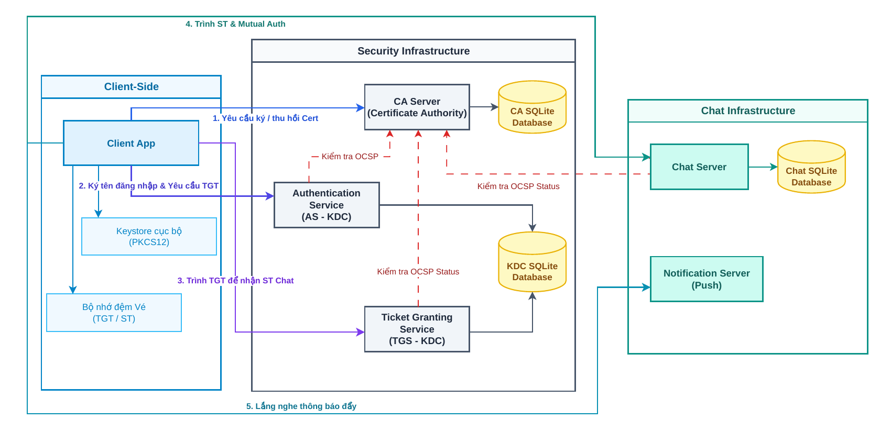
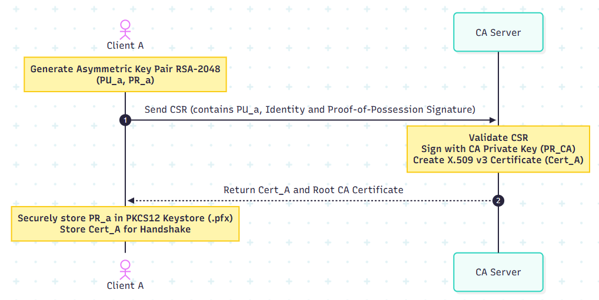
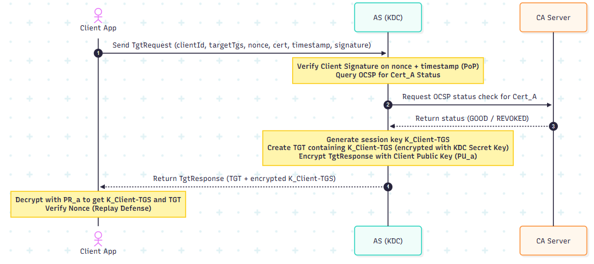
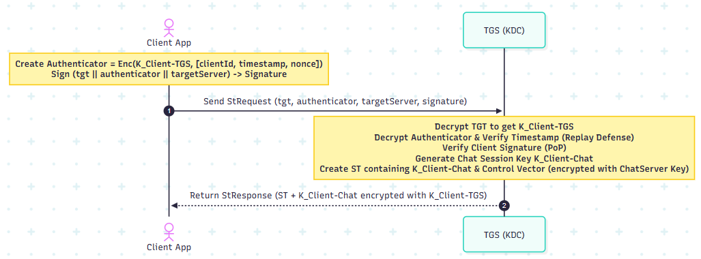
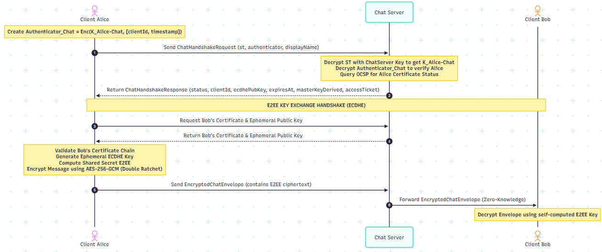

# SECURECHAT - HỆ THỐNG NHẮN TIN BẢO MẬT ĐẦU CUỐI (E2EE)

[](#)
[](https://openjdk.org)
[](https://maven.apache.org)
[](#)
[](#)

Hệ thống nhắn tin bảo mật đầu cuối (End-to-End Encryption - E2EE) đa module được phát triển trên ngôn ngữ Java. Dự án áp dụng mô hình kiến trúc lai bảo mật kết hợp giữa giao thức xác thực nâng cấp từ **Kerberos V5** (sử dụng chữ ký số và vé thay cho mật khẩu tĩnh) và **Hạ tầng khóa công khai PKI** (xác thực trạng thái chứng chỉ trực tuyến OCSP thời gian thực).


## Mục lục
1. [Giới thiệu & Tính năng](#giới-thiệu--tính-năng)
2. [Quy trình hoạt động & Kiến trúc hệ thống](#quy-trình-hoạt-động--kiến-trúc-hệ-thống)
3. [Công nghệ sử dụng](#công-nghệ-sử-dụng)
4. [Thông tin máy chủ Azure Cloud](#thông-tin-máy-chủ-azure-cloud)
5. [Hướng dẫn khởi chạy hệ thống](#hướng-dẫn-khởi-chạy-hệ-thống)
6. [Cấu trúc thư mục dự án](#cấu-trúc-thư-mục-dự-án)
7. [Tác giả & Phân công nhiệm vụ](#tác-giả--phân-công-nhiệm-vụ)

## Giới thiệu & Tính năng

Dự án giải quyết bài toán bảo mật thông tin liên lạc và truyền dữ liệu qua mạng diện rộng (WAN) dưới triết lý **Zero-Trust**. Bằng cách mã hóa dữ liệu ngay tại thiết bị đầu cuối và thỏa thuận khóa động, hệ thống loại bỏ hoàn toàn rủi ro bị nghe lén (Eavesdropping), tấn công xen giữa (MITM), tấn công phát lại (Replay Attack) hay rò rỉ dữ liệu từ máy chủ trung gian.

### Các tính năng cốt lõi:
- **Mã hóa đầu cuối (E2EE):** Tin nhắn và tệp tin được mã hóa AES-256-GCM trực tiếp tại thiết bị người gửi và chỉ giải mã được tại thiết bị người nhận hợp lệ.
- **Bảo mật chuyển tiếp hoàn hảo (PFS):** Thỏa thuận khóa phiên động ECDHE (secp256r1) cho mỗi phiên chat, bảo vệ tuyệt đối lịch sử hội thoại nếu khóa dài hạn bị lộ.
- **Đăng nhập một lần (SSO):** Thiết kế theo cơ chế Kerberos giúp người dùng chỉ cần mở khóa Keystore cục bộ 1 lần để lấy vé TGT, tự động đăng nhập đồng thời vào Chat Server và Notification Server.
- **Xác thực trạng thái chứng chỉ số trực tuyến (OCSP):** Tích hợp OCSP Responder tại CA Server để kiểm tra tức thời chứng chỉ của người dùng có bị thu hồi hay không trước khi cấp quyền truy cập.
- **Nhật ký kiểm toán an toàn (Audit Logs):** Áp dụng cấu trúc liên kết băm (Hash-Chain) kết hợp chữ ký HMAC-SHA256 để phát hiện mọi hành vi sửa đổi trái phép nhật ký hệ thống.
- **Truyền File E2EE Phân đoạn:** Hỗ trợ truyền tệp lớn bằng cách chia nhỏ thành các đoạn chunk 512KB, mã hóa độc lập trước khi gửi qua server trung chuyển.

## Quy trình hoạt động & Kiến trúc hệ thống

### Sơ đồ kiến trúc tổng thể hệ thống SecureChat
* [Tải về/Xem sơ đồ kiến trúc chi tiết (PDF)](doc/image/architect.pdf)


Quy trình bảo mật của SecureChat được chia thành 4 giai đoạn chính để thiết lập lòng tin và thực hiện giao tiếp bảo mật đầu cuối:

### Giai đoạn 1: Đăng ký định danh & Cấp chứng chỉ số X.509 v3 (PKI Setup)
Client tự sinh cặp khóa định danh RSA-2048 cục bộ, gửi tệp yêu cầu ký chứng chỉ (CSR) lên CA Server. CA thực hiện kiểm tra, ký duyệt và trả về chứng chỉ X.509 v3 định danh cho Client.
*   **Sơ đồ quy trình:**
    

### Giai đoạn 2: Đăng nhập ban đầu và cấp vé nhận dạng TGT (AS Flow)
Client sử dụng private key ký số thử thách để đăng nhập. Máy chủ Authentication Service (AS) kiểm tra trạng thái chứng chỉ qua OCSP, sau đó cấp vé TGT và session key $K_{Client-TGS}$ mã hóa bằng public key của Client.
*   **Sơ đồ quy trình:**
    

### Giai đoạn 3: Cấp Vé dịch vụ Service Ticket (TGS Flow)
Client trình vé TGT lên Ticket Granting Service (TGS) để yêu cầu vé dịch vụ ST kết nối tới Chat Server. Vé ST được đính kèm thuộc tính quyền hạn (Control Vector) và được mã hóa bằng khóa bí mật của Chat Server.
*   **Sơ đồ quy trình:**
    

### Giai đoạn 4: Đăng nhập Chat, Xác thực 2 chiều & Nhắn tin E2EE (Chat & ECDHE Handshake)
Client trình vé ST lên Chat Server để xác thực hai chiều và đăng nhập. Khi nhắn tin, người gửi và người nhận thỏa thuận khóa đối xứng động thông qua bắt tay ECDHE (được ký số bằng khóa định danh để chống MITM). Chat Server định tuyến tin nhắn dưới dạng nhị phân mã hóa mà không thể giải mã nội dung (Zero-Knowledge).
*   **Sơ đồ quy trình:**
    

## Công nghệ sử dụng

Hệ thống được tổ chức dưới dạng dự án Maven đa module (Multi-Module Maven Project), sử dụng các công nghệ hiện đại và thư viện chuẩn:

- **Core Cryptography (shared-lib):** BouncyCastle (JCE Provider), AES-256-GCM (Mã hóa đối xứng xác thực), ECDSA/RSA (Chữ ký số), ECDHE (secp256r1 - Thỏa thuận khóa tạm thời), PBKDF2 (100,000 vòng lặp & Salt phái sinh khóa cục bộ), HMAC-SHA256 (Bảo vệ logs).
- **Desktop UI (client-app):** Java Swing (thiết kế giao diện hiện đại dạng Glassmorphism), Jackson Databind (Serialization/Deserialization gói tin JSON).
- **Database (SQLite):** SQLCipher & SQLite JDBC (Lưu trữ chứng chỉ CA, vé KDC và lịch sử chat cục bộ một cách an toàn).
- **Deployment & Cloud:** Microsoft Azure VM (Ubuntu Server), jpackage (Đóng gói ứng dụng Java thành tệp thực thi `.exe` độc lập kèm máy ảo Java rút gọn).

## Thông tin máy chủ Azure Cloud

Toàn bộ các máy chủ Backend của dự án đã được cài đặt và vận hành trực tuyến 24/7 trên máy ảo **Azure Cloud VM** để phục vụ chạy thử nghiệm:

*   **IP Máy chủ:** `70.153.139.17`
*   **Danh sách các cổng dịch vụ:**
    *   `8443`: CA HTTPS (SSL)
    *   `8881`: Authentication Service (AS)
    *   `8882`: Ticket Granting Service (TGS)
    *   `8883`: Chat Server Connection
    *   `8884`: OCSP Responder
    *   `8885`: Notification Server (Push Notifications)

> [!NOTE]
> Do máy chủ đã chạy sẵn 24/7 trên đám mây, bạn chỉ cần tải bản đóng gói Client và chạy trực tiếp để kiểm thử kết nối mà không cần tự khởi động cụm server cục bộ.

## Hướng dẫn khởi chạy hệ thống

### PHƯƠNG ÁN 1: Chạy nhanh từ thư mục đóng gói ZIP (Khuyên dùng)
Dành cho người dùng cuối hoặc kiểm thử nhanh giao diện chat kết nối trực tiếp đến Cloud Server Azure (Không cần cài Java/Maven trên máy).

1.  **Tải và giải nén:**
    *   Tải xuống file `SecureChat_E2EE.zip`.
    *   Giải nén tệp tin ra một thư mục sạch trên máy tính của bạn.
2.  **Cấu hình kết nối:**
    *   Mở tệp `config.properties` trong thư mục vừa giải nén.
    *   Địa chỉ mặc định đang trỏ tới IP Azure `70.153.139.17`. Bạn chỉ cần chỉnh sửa nếu muốn trỏ về máy chủ cục bộ khác.
3.  **Khởi chạy:**
    *   Nhấp đúp chuột vào file **`SecureChat.exe`** để mở ứng dụng Client.
    *   Thực hiện đăng ký tài khoản, đăng nhập và bắt đầu chat bảo mật.

### PHƯƠNG ÁN 2: Biên dịch và chạy từ Mã nguồn (Yêu cầu Java 21+ và Maven)

#### 1. Yêu cầu hệ thống tiên quyết
Đảm bảo máy tính của bạn đã được cài đặt:
- **JDK 21** trở lên.
- **Apache Maven 3.9.x** trở lên.
- **Git**.

#### 2. Biên dịch mã nguồn dự án
Mở terminal tại thư mục gốc của dự án (`d:\MHUD\PROJECT\src`) và thực hiện biên dịch:
```bash
mvn clean install -DskipTests
```

#### 3. Cấu hình biến môi trường / File cấu hình
Nếu chạy cục bộ (Local), hãy tạo tệp tin cấu hình `config.properties` hoặc truyền các tham số Java System Property khi chạy để ứng dụng biết địa chỉ IP của server.

#### 4. Khởi chạy cụm Server cục bộ (Nếu không dùng Azure Cloud)
Chạy từng lệnh dưới đây trong các terminal riêng biệt để khởi động cụm máy chủ Backend:
```bash
# Terminal 1: Khởi động Certificate Authority Server (CA)
mvn exec:java -pl ca-server

# Terminal 2: Khởi động Key Distribution Center (KDC - AS & TGS)
mvn exec:java -pl kdc-server

# Terminal 3: Khởi động Chat Server
mvn exec:java -pl chat-server

# Terminal 4: Khởi động Notification Server (Push)
mvn exec:java -pl notification-server
```

#### 5. Khởi chạy ứng dụng Client
*   **Kết nối tới đám mây Azure VM:**
    ```bash
    mvn exec:java -pl client-app
    ```
*   **Kết nối tới máy chủ Localhost cá nhân:**
    ```bash
    mvn exec:java -pl client-app -Dca.host=127.0.0.1 -Das.host=127.0.0.1 -Dchat.host=127.0.0.1 -Dnotification.host=127.0.0.1
    ```

## Cấu trúc thư mục dự án

```text
├── doc/
│   ├── image/                 # Các sơ đồ thiết kế và hình ảnh quy trình hoạt động
│   └── require.md             # Tài liệu yêu cầu kỹ thuật & UI/UX Glassmorphism
├── src/                       # Mã nguồn toàn bộ dự án Maven
│   ├── pom.xml                # POM Parent quản lý dependencies chung
│   ├── shared-lib/            # Thư viện dùng chung (Mã hóa, DTOs, Giao thức mạng)
│   ├── ca-server/             # Máy chủ cấp phát chứng chỉ X.509 và OCSP Responder
│   ├── kdc-server/            # Trung tâm phân phối khóa Kerberos (AS & TGS)
│   ├── chat-server/           # Máy chủ định tuyến tin nhắn, quản lý kênh chat
│   ├── notification-server/   # Máy chủ đẩy thông báo thời gian thực
│   ├── client-app/            # Ứng dụng chat giao diện Swing và xử lý Client Crypto
│   └── data/                  # Thư mục chứa Keystores (.pfx, .p12) và Database SQLite
├── target/dist/               # Chứa ứng dụng Client sau khi đóng gói jpackage (.exe)
├── README.md                  # Hướng dẫn sử dụng này
└── .gitignore                 # Cấu hình bỏ qua các tệp tin build/logs của Git
```

## Tác giả & Phân công nhiệm vụ

| STT | Họ và Tên | MSSV | Vai trò & Nhiệm vụ chính |
| :---: | :--- | :---: | :--- |
| 1 | **Gia Hiển** | 23120123 | **Nhóm trưởng** / Thiết kế Core Crypto, AS & TGS (KDC Server), Lọc Replay, Phân quyền Control Vector. |
| 2 | **Anh Tuấn** | 23120184 | **CA Developer** / Thiết kế Root CA, API cấp chứng chỉ CSR, OCSP Responder xác thực thu hồi chứng chỉ. |
| 3 | **Phú Thọ** | 23120169 | **Network & Chat Engineer** / Cấu trúc khung truyền dữ liệu PacketFrame, Chat Server TCP đa luồng, Notification Server. |
| 4 | **Trúc Ngọc** | 23120148 | **UI/UX & Client Integrator** / Thiết kế giao diện Swing Glassmorphism, Client Crypto, local Keystore, JUnit Integration tests. |
