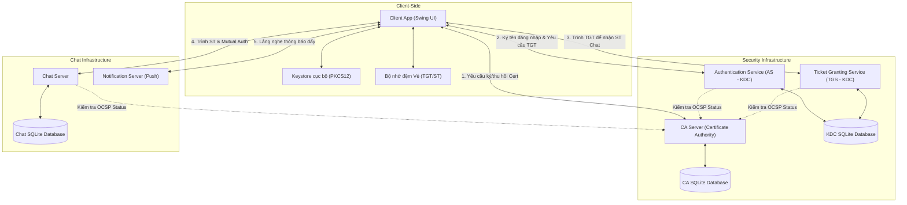
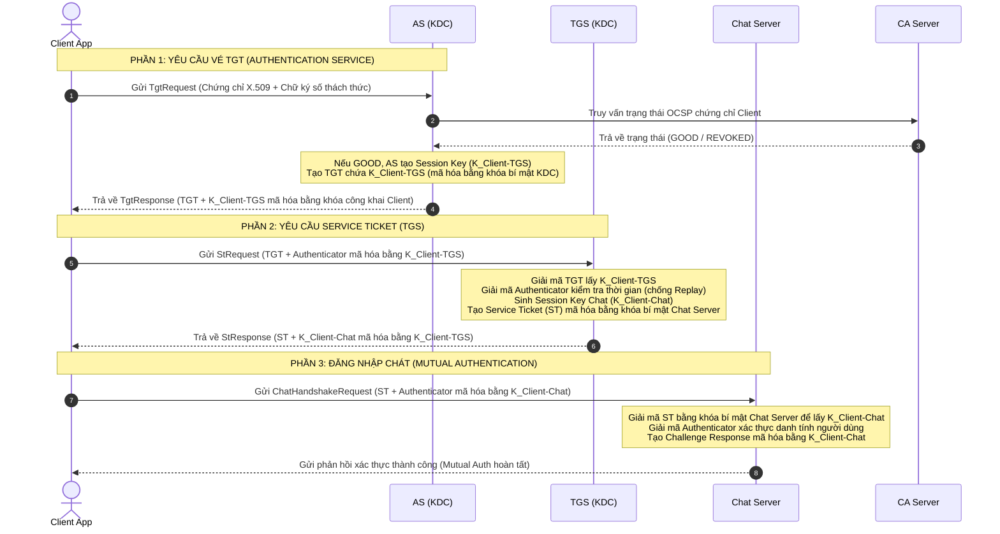
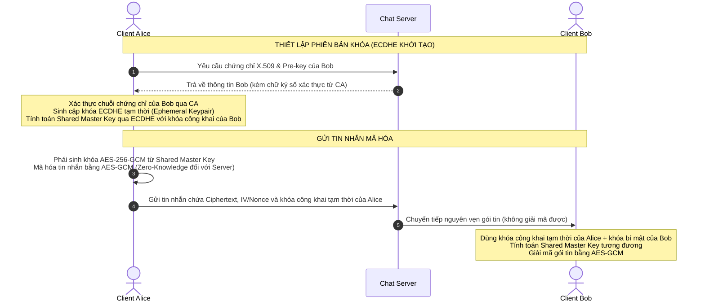

# BÁO CÁO KỸ THUẬT: HỆ THỐNG NHẮN TIN BẢO MẬT ĐẦU CUỐI (E2EE) SECURECHAT
> **Môn học:** Mã hóa Ứng dụng (CSC15003) - Giảng viên hướng dẫn: ThS. Mai Anh Tuấn.

---

## 1. Thông tin nhóm phát triển

| STT | Họ và Tên | MSSV | Vai trò chính | Tỷ lệ đóng góp |
| :---: | :--- | :---: | :--- | :---: |
| 1 | **Gia Hiển** | 23120123 | Nhóm trưởng, Core Crypto, KDC, Shared-lib | 25% |
| 2 | **Anh Tuấn** | 23120184 | CA Server, PKI Workflow, OCSP | 25% |
| 3 | **Phú Thọ** | 23120169 | Chat Server, Network Protocol, Routing | 25% |
| 4 | **Trúc Ngọc** | 23120148 | UI/UX Swing, Client Integration, Testing | 25% |

---

## 2. Tổng quan Đề tài
**SecureChat E2EE** là hệ thống nhắn tin bảo mật thời gian thực, bảo vệ toàn vẹn thông tin người dùng từ đầu cuối đến đầu cuối (End-to-End Encryption). Dự án tích hợp hai trụ cột bảo mật kinh điển:
1. **Hạ tầng khóa công khai (PKI - Public Key Infrastructure):** Quản lý vòng đời chứng chỉ số X.509, hỗ trợ cơ chế kiểm tra thu hồi trực tuyến OCSP (Online Certificate Status Protocol).
2. **Kiến trúc Kerberos (KDC - Key Distribution Center):** Xác thực tập trung một lần đăng nhập (Single Sign-On) thông qua cơ chế cấp Vé nhận dạng (TGT) và Vé dịch vụ (Service Ticket), hỗ trợ phân quyền người dùng thông qua Control Vector.

---

## 3. Kiến trúc hệ thống & Các thành phần

Hệ thống được tổ chức theo mô hình Multi-Module Maven với sơ đồ kiến trúc các thành phần như sau:



### Chi tiết các module:
*   **`shared-lib`:** Chứa toàn bộ lõi mã hóa (AES-GCM, ECDSA, ECDHE, SHA-256), giao thức truyền tin (PacketFrame), và định nghĩa dữ liệu (DTOs).
*   **`ca-server`:** Đóng vai trò Certificate Authority. Cấp chứng chỉ X.509 cho người dùng/server, lưu trữ DB chứng chỉ và chạy cổng OCSP Responder để xác thực trạng thái thu hồi chứng chỉ.
*   **`kdc-server`:** Trung tâm phân phối khóa Kerberos. Gồm cổng AS (xác thực chữ ký số người dùng, cấp TGT) và cổng TGS (xác thực TGT, cấp ST Chat kèm Control Vector phân quyền).
*   **`chat-server`:** Định tuyến tin nhắn E2EE, quản lý phòng chat và xác thực vé ST từ người dùng.
*   **`notification-server`:** Đẩy thông báo hệ thống thời gian thực tới Client.
*   **`client-app`:** Giao diện người dùng Java Swing, xử lý mã hóa E2EE cục bộ, quản lý bộ nhớ đệm vé (Ticket Cache).

---

## 4. Cơ chế trao đổi khóa & Truyền thông tin E2EE

### 4.1. Quy trình Xác thực & Phân phối vé KDC (Kerberos-like Flow)
Quy trình đăng nhập một lần (SSO) và thiết lập kênh truyền với Chat Server tuân thủ nghiêm ngặt mô hình Kerberos:



---

### 4.2. Quy trình thiết lập kênh mã hóa E2EE giữa 2 Client
Sau khi đăng nhập Chat Server, tin nhắn giữa 2 người dùng được mã hóa bằng AES-256-GCM với cơ chế trao đổi khóa Diffie-Hellman tạm thời (ECDHE):



---

## 5. Các tình huống tấn công & Giải pháp Bảo vệ

| Tình huống tấn công | Cơ chế phòng thủ trên hệ thống |
| :--- | :--- |
| **Nghe lén trên đường truyền** | Toàn bộ nội dung tin nhắn được mã hóa E2EE bằng AES-GCM 256-bit trực tiếp ở Client. Chat Server chỉ forward gói tin nhị phân và không nắm giữ khóa giải mã (Zero-Knowledge). |
| **Tấn công phát lại (Replay Attack)** | Mỗi vé (TGT/ST) và gói tin Authenticator đều đính kèm một `Timestamp` (chỉ chấp nhận độ lệch tối đa 300 giây) kết hợp kiểm tra bộ đệm `Nonce Cache` để phát hiện và loại bỏ các gói tin bị gửi lại. |
| **Tấn công giả mạo (MITM)** | Mọi hoạt động trao đổi khóa công khai đều được ký số. Client luôn xác thực chuỗi chứng chỉ X.509 của Server lên tới Root CA và kiểm tra trạng thái thu hồi trực tuyến qua OCSP trước khi gửi thông tin nhạy cảm. |
| **Giả mạo/Thay đổi lịch sử hệ thống** | Lịch sử nhật ký hoạt động nhạy cảm (như đăng nhập, thu hồi khóa) được lưu trữ dưới dạng chuỗi liên kết băm (**Hash-Chain**). Mỗi bản ghi chứa mã băm của bản ghi trước đó kết hợp khóa mã hóa **HMAC** để ngăn chặn chỉnh sửa trái phép. |
| **Trộm vé dịch vụ (Ticket Theft)** | Vé (TGT/ST) được cấu hình có thời hạn sử dụng ngắn (TGT: 8 giờ, ST: 1 giờ) và chứa thông tin định danh duy nhất của Client. Việc sử dụng vé yêu cầu giải mã bằng khóa phiên (Session Key) tương ứng mà chỉ Client hợp lệ sở hữu. |

---

## 6. Quyết định kỹ thuật & Các thay đổi quan trọng mới nhất

Hệ thống đã trải qua đợt tái cấu trúc lớn nhằm đáp ứng tính tiện dụng và khả năng vận hành thực tế:
*   **Di chuyển KeyStore đa nền tảng (Cross-Platform PKCS12):** Loại bỏ hoàn toàn sự phụ thuộc vào Windows KeyStore (`SunMSCAPI`/DPAPI). Toàn bộ chứng chỉ và khóa bí mật được quản lý bằng tệp tin PKCS12 tiêu chuẩn (`.pfx`) đặt dưới thư mục dữ liệu, sử dụng mật khẩu mặc định `"changeit"`. Hệ thống hiện tại có thể khởi chạy mượt mà trên **Windows, Linux, và macOS**.
*   **Cấu hình động ngoài (`config.properties`):** Client và các Server hỗ trợ đọc file cấu hình máy chủ `config.properties` đặt tại thư mục thực thi. Độ ưu tiên phân giải cấu hình: *Tham số khởi chạy JVM `-D` > File `config.properties` > Địa chỉ Azure IP mặc định (`70.153.139.17`)*.
*   **Đóng gói Standalone không phụ thuộc JRE:** Ứng dụng Client được đóng gói bằng công nghệ `jpackage` thành một thư mục chứa tệp tin thực thi `SecureChat.exe` tích hợp sẵn máy ảo Java rút gọn. Người dùng cuối có thể giải nén và chạy trực tiếp ứng dụng mà không cần cài đặt Java trên hệ điều hành.

---

## 7. Môi trường triển khai thực tế (Azure Cloud)

Để hỗ trợ kiểm thử thực tế và nghiệm thu đề tài một cách dễ dàng, toàn bộ các thành phần phía máy chủ (Backend Servers) đã được triển khai sẵn trên một máy ảo đám mây **Microsoft Azure VM** chạy hệ điều hành Linux Ubuntu.

### Thông tin kết nối máy chủ Azure:
*   **Địa chỉ IP máy chủ:** `70.153.139.17`
*   **Danh sách các cổng dịch vụ (Ports):**
    *   **CA HTTPS Port (SSL):** `8443`
    *   **AS Service Port:** `8881`
    *   **TGS Service Port:** `8882`
    *   **Chat Server Port:** `8883`
    *   **OCSP Responder Port:** `8884`
    *   **Notification Port (Realtime Push):** `8885`

> [!TIP]
> Do toàn bộ máy chủ đã được vận hành 24/7 trên Azure, người kiểm thử **chỉ cần khởi chạy duy nhất ứng dụng Client** (chạy tệp `SecureChat.exe` từ gói đóng gói sẵn hoặc chạy từ mã nguồn trỏ IP tới Azure) là đã có thể thực hiện đăng ký, đăng nhập và nhắn tin bảo mật thời gian thực ngay lập tức mà không cần tự khởi động bất kì máy chủ nào trên máy cá nhân.

---

## 8. Hướng dẫn khởi chạy hệ thống

### 8.1. Chạy nhanh Client từ tệp đóng gói (Khuyên dùng)
1. Tải và giải nén tệp tin đóng gói sẵn [SecureChat_E2EE.zip](file:///d:/MHUD/PROJECT/SecureChat_E2EE.zip).
2. Điều chỉnh địa chỉ IP máy chủ Azure trong tệp `config.properties` đi kèm nếu máy chủ thay đổi.
3. Kích đúp vào tệp tin `SecureChat.exe` để khởi chạy trực tiếp giao diện chat.

### 7.2. Chạy từ Mã nguồn (Yêu cầu cài đặt Java 21+ và Maven)

#### 1. Biên dịch toàn bộ dự án
Mở terminal tại thư mục `PROJECT/src` và chạy:
```bash
mvn clean install -DskipTests
```

#### 2. Khởi chạy các Server trên máy cục bộ
Mở các terminal riêng biệt để chạy các lệnh sau:
1.  **CA Server:** `mvn exec:java -pl ca-server`
2.  **KDC Server:** `mvn exec:java -pl kdc-server`
3.  **Chat Server:** `mvn exec:java -pl chat-server`
4.  **Notification Server:** `mvn exec:java -pl notification-server`

#### 3. Khởi chạy Client
Chạy lệnh sau để khởi động Client mặc định (kết nối trực tiếp tới Azure):
```bash
mvn exec:java -pl client-app
```
Hoặc kết nối tới máy chủ tùy chọn thông qua tham số khởi chạy JVM:
```bash
mvn exec:java -pl client-app -Dca.host=127.0.0.1 -Das.host=127.0.0.1 -Dchat.host=127.0.0.1 -Dnotification.host=127.0.0.1
```

---

## 9. Cấu trúc lưu trữ dữ liệu
*   `src/data/ca/`: Chứa cơ sở dữ liệu chứng chỉ `ca-server.db` và Keystore PKCS12 của Root CA.
*   `src/data/keys/`: Chứa Keystore PKCS12 của các dịch vụ trung gian (AS, TGS, Chat).
*   `target/dist/`: Thư mục đầu ra chứa tệp tin thực thi đóng gói độc lập.

---
*Bản quyền báo cáo kỹ thuật thuộc về Nhóm dự án Mã hóa ứng dụng - CSC15003 - HCMUS.*
