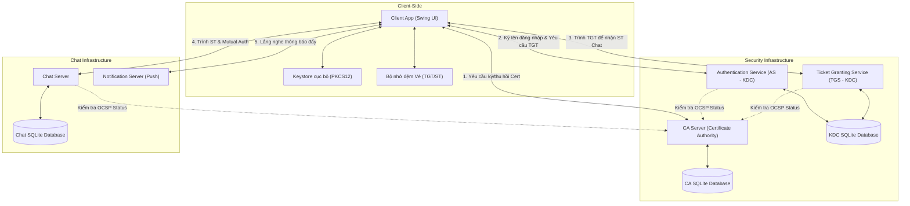
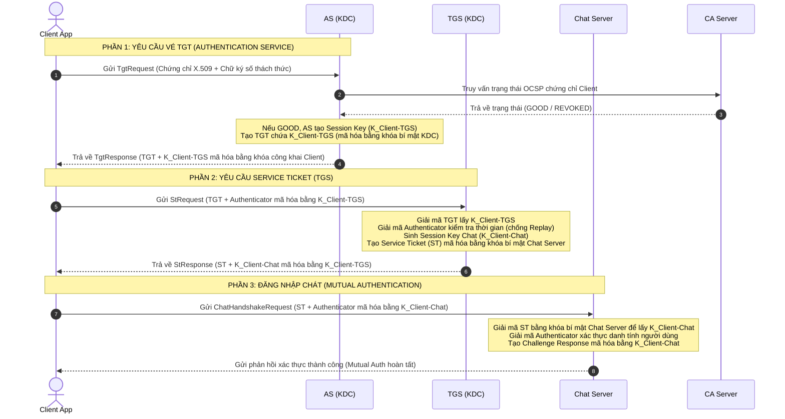
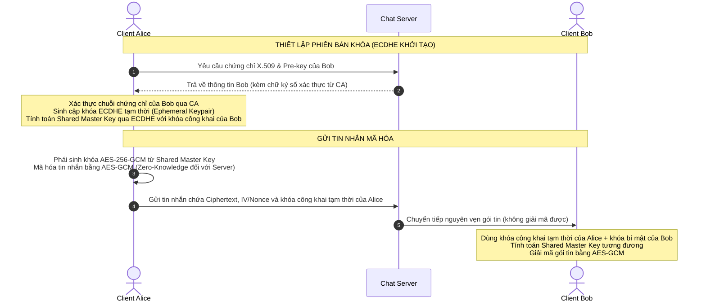

# BÁO CÁO KỸ THUẬT: HỆ THỐNG NHẮN TIN BẢO MẬT ĐẦU CUỐI (E2EE) SECURECHAT
> **Môn học:** Mã hóa Ứng dụng (CSC15003) - Giảng viên hướng dẫn: ThS. Mai Anh Tuấn.

---

## 1. Thông tin nhóm phát triển & Phân công nhiệm vụ

| STT | Họ và Tên | MSSV | Vai trò chính | Tỷ lệ đóng góp |
| :---: | :--- | :---: | :--- | :---: |
| 1 | **Gia Hiển** | 23120123 | Nhóm trưởng, Core Crypto, KDC, Shared-lib | 25% |
| 2 | **Anh Tuấn** | 23120184 | CA Server, PKI Workflow, OCSP | 25% |
| 3 | **Phú Thọ** | 23120169 | Chat Server, Network Protocol, Routing | 25% |
| 4 | **Trúc Ngọc** | 23120148 | UI/UX Swing, Client Integration, Testing | 25% |

### Bảng phân rã chi tiết công việc của các thành viên:

#### 1. Gia Hiển (23120123) - Nhóm trưởng, Core Cryptography & KDC Developer
*   **Thiết kế kiến trúc hệ thống:** Lên ý tưởng, định hình mô hình tương tác giữa Client - CA - KDC - Chat Server.
*   **Core Cryptography (shared-lib):** Xây dựng lõi mật mã đối xứng AES-256-GCM (đảm bảo tính bí mật và toàn vẹn), chữ ký số ECDSA (xác thực danh tính) và giao thức bắt tay trao đổi khóa Diffie-Hellman tạm thời (ECDHE) qua khóa Elliptic Curve.
*   **KDC Server (kdc-server):**
    *   **Cổng AS (Authentication Service):** Xác thực chữ ký số người dùng dựa trên mật khẩu và chứng chỉ số X.509, sinh khóa phiên tạm thời và cấp Vé nhận dạng (TGT).
    *   **Cổng TGS (Ticket Granting Service):** Xác thực TGT và Authenticator nhận được từ Client để cấp Vé dịch vụ (Service Ticket - ST) kết nối Chat Server.
*   **Cơ chế Chống Replay & Phân quyền:** Thiết kế cơ chế lọc Replay Attack sử dụng Nonce Cache kết hợp sai lệch Timestamp, tích hợp trường `Control Vector` vào ST để thực hiện phân quyền người dùng (Role-Based Access Control).

#### 2. Anh Tuấn (23120184) - PKI Infrastructure & CA Developer
*   **Thiết kế Root CA (ca-server):** Xây dựng hệ thống Certificate Authority để quản lý vòng đời chứng chỉ khóa công khai. Khởi tạo cặp khóa ECDSA cho CA và sinh tệp chứng chỉ Root CA tự ký tin cậy.
*   **Certificate Authority Service:** Phát triển các API cho phép Client đăng ký tài khoản, gửi yêu cầu ký chứng chỉ số (CSR) và CA tự động cấp phát chứng chỉ định dạng X.509.
*   **OCSP Responder:** Triển khai dịch vụ xác thực trạng thái chứng chỉ số trực tuyến qua giao thức OCSP (Online Certificate Status Protocol) giúp các Server (KDC, Chat) kiểm tra trạng thái chứng chỉ của Client theo thời gian thực.
*   **Thu hồi chứng chỉ (Revocation System):** Xây dựng API gửi yêu cầu thu hồi (Revoke Request) kèm chữ ký số xác thực để hủy bỏ chứng chỉ khi người dùng bị lộ khóa bí mật hoặc thay đổi khóa.

#### 3. Phú Thọ (23120169) - Chat Infrastructure & Network Protocol Engineer
*   **Giao thức truyền dữ liệu (Network Protocol):** Định nghĩa cấu trúc khung gói tin `PacketFrame` để phân mảnh dữ liệu (Data Framing) bao gồm loại gói tin, mã hóa header, payload hỗ trợ truyền tin nhắn và gửi file dung lượng lớn.
*   **Chat Server (chat-server):** Thiết lập kết nối TCP Socket đa luồng (Multi-threading), quản lý các kết nối trực tuyến (Active Session), định tuyến tin nhắn, xử lý hàng đợi tin nhắn và tạo kênh chat đôi, chat nhóm.
*   **Notification Server (notification-server):** Xây dựng cổng dịch vụ đẩy thông báo sự kiện (Push Notification) thời gian thực tới Client (ví dụ: thông báo hệ thống, thông báo tin nhắn mới khi đang ở tab khác).
*   **Tích hợp OCSP Stapling:** Thiết kế cơ chế kẹp trạng thái chứng chỉ OCSP trực tiếp vào handshake TLS/SSL để tối ưu hóa hiệu năng, giảm tải truy vấn lặp đi lặp lại lên CA Server.

#### 4. Trúc Ngọc (23120148) - UI/UX Designer & Client Integration Tester
*   **Thiết kế Giao diện người dùng (client-app):** Thiết kế toàn bộ giao diện bằng Java Swing hiện đại theo phong cách Figma (Darkmode sang trọng, Layout chia cột 64/36, hiệu ứng tương tác nút bấm, khung chat động và thanh thông báo tiến trình hoạt động Activity Flow).
*   **Quản lý Khóa cục bộ & Client Crypto:** Tích hợp logic nạp/xuất khóa bảo mật từ tệp PKCS12 (`.pfx`) cục bộ tại Client, xây dựng cache quản lý vé tạm thời (Ticket Cache) tại Client để thực hiện Single Sign-On (SSO).
*   **Tính năng Truyền File E2EE:** Thiết kế giao diện và xử lý logic chia tệp tin thành các khối chunk 512KB, mã hóa từng chunk bằng AES-GCM với khóa phiên sinh ngẫu nhiên (Zero-Knowledge) trước khi gửi qua Chat Server.
*   **Kịch bản kiểm thử (JUnit Testing):** Xây dựng và thực thi 45 kịch bản kiểm thử tích hợp tự động kiểm tra tính chính xác của các thuật toán mã hóa, bắt tay Kerberos, xác thực OCSP và chống tấn công Replay.

---

## 2. Tổng quan Đề tài & Các chức năng hoàn thành

### 2.1. Mô tả đề tài
Dự án **SecureChat E2EE** được xây dựng nhằm giải quyết triệt để lỗ hổng "Server Trust" (Tin tưởng máy chủ trung tâm) của các hệ thống nhắn tin truyền thống. Bằng cách áp dụng triết lý thiết kế **Zero Trust**, hệ thống kết hợp hai trụ cột bảo mật kinh điển:
1.  **Hạ tầng khóa công khai (PKI):** Xác thực danh tính người dùng và các thực thể dịch vụ bằng chứng chỉ số X.509 v3, kiểm tra trạng thái thu hồi trực tuyến thời gian thực thông qua OCSP.
2.  **Kiến trúc xác thực và phân quyền tập trung (Kerberos-like KDC):** Cho phép người dùng đăng nhập một lần (Single Sign-On - SSO) thông qua cơ chế trao đổi Vé nhận dạng (TGT) và Vé dịch vụ (Service Ticket - ST), kết hợp trường `Control Vector` để phân quyền người dùng.
3.  **Mã hóa đầu cuối (E2EE):** Nội dung tin nhắn và tệp tin giữa hai Client được bảo vệ bằng giao thức **Double Ratchet / ECDHE** (Zero-Knowledge đối với các máy chủ trung gian).

### 2.2. Các chức năng đã hoàn thành
*   **Client App (`client-app`):**
    *   Đăng ký tài khoản mới: Tự động sinh cặp khóa định danh RSA-2048, gửi yêu cầu ký chứng chỉ (CSR) lên CA.
    *   Đăng nhập SSO bằng vé: Lưu trữ vé tạm thời cục bộ (Ticket Cache), tự động gia hạn vé (Renewable Ticket) để kết nối nhanh không cần nhập lại mật khẩu.
    *   Nhắn tin thời gian thực: Chat cá nhân và chat nhóm bảo mật.
    *   Gửi file mã hóa E2EE: Phân mảnh tệp tin thành các chunk 512KB, mã hóa bằng AES-GCM với khóa phiên sinh ngẫu nhiên trước khi truyền.
*   **CA Server (`ca-server`):**
    *   Phê duyệt và ký số chứng chỉ số X.509 v3 cho Client và các Server khác.
    *   OCSP Responder: Xác thực trạng thái chứng chỉ số của Client trực tuyến thời gian thực.
    *   Hệ thống thu hồi: Cho phép người dùng gửi yêu cầu hủy chứng chỉ số (Revoke Request) kèm chữ ký số xác thực.
*   **KDC Server (`kdc-server`):**
    *   Cổng AS (Authentication Service): Xác thực chữ ký số thách thức của Client, cấp vé TGT.
    *   Cổng TGS (Ticket Granting Service): Xác thực vé TGT, cấp vé ST Chat kèm cấu hình Control Vector tương ứng với vai trò của Client.
*   **Chat Server (`chat-server`):**
    *   Xác thực vé ST từ Client, thực hiện bắt tay Mutual Authentication.
    *   Định tuyến gói tin E2EE (chỉ chuyển tiếp nhị phân, hoàn toàn không giải mã payload tin nhắn của người dùng).
*   **Notification Server (`notification-server`):**
    *   Hỗ trợ đẩy thông báo sự kiện thời gian thực độc lập tới Client.

---

## 3. Bảng tự đánh giá kỹ thuật theo Checklist của Giảng viên

| Mức độ | Yêu cầu Kỹ thuật từ Giảng viên | Đạt | Giải thích Giải pháp Kỹ thuật trong Dự án |
| :---: | :--- | :---: | :--- |
| **Cơ bản** | Mã hóa dữ liệu bằng symmetric encryption | ✓ | Nội dung tin nhắn và file được mã hóa đối xứng bằng thuật toán **AES-256-GCM** (chế độ AEAD đảm bảo tính bí mật và tính toàn vẹn). |
| **Cơ bản** | Dùng hybrid encryption để phân phối khóa phiên hoặc KDC ở mức cơ bản | ✓ | Tích hợp kiến trúc KDC cấp khóa phiên thông qua cấu trúc Vé. AS dùng khóa công khai RSA của Client trong chứng chỉ để mã hóa bọc khóa phiên kết nối TGS. |
| **Cơ bản** | Có key lifecycle: sinh khóa, phân phối, thời hạn, thay khóa | ✓ | Vòng đời khóa được quản lý khép kín: Client tự sinh khóa định danh; khóa phiên được phân phối qua vé Kerberos; Vé TGT và ST có thời hạn sử dụng cố định và được tự động thay thế liên tục qua giao thức ECDHE động cho mỗi phiên kết nối. |
| **Cơ bản** | Có xác thực người dùng: identification + verification | ✓ | Định danh qua trường `clientId` và xác thực thông qua chữ ký số thách thức (Proof-of-Possession) ký bởi khóa bí mật RSA của Client thay vì truyền mật khẩu bản rõ qua mạng. |
| **Cơ bản** | Có chống replay bằng nonce/timestamp/challenge-response | ✓ | Mọi Authenticator gửi kèm vé đều chứa `timestamp` (giới hạn sai lệch tối đa 300 giây) kết hợp kiểm tra tính duy nhất qua bộ đệm `Nonce Cache`. |
| **Cơ bản** | Có xác thực nguồn khóa công khai: tối thiểu qua trusted public key / certificate đơn giản | ✓ | Sử dụng tệp tin Keystore PKCS12 (`.pfx`) cục bộ để lưu trữ và thẩm định chuỗi chứng chỉ X.509 liên kết ngược lên CA Gốc đáng tin cậy. |
| **Mức khá** | Tách rõ master key và session key | ✓ | Phân biệt rạch ròi giữa **Khóa định danh bất đối xứng dài hạn (Asymmetric Identity Key RSA-2048)** lưu trong Keystore và **Khóa phiên đối xứng tạm thời (Symmetric Session Key AES-256)** chỉ lưu trên RAM. |
| **Mức khá** | Có KDC/KMS hoặc dịch vụ quản lý khóa tập trung | ✓ | Tách cụm dịch vụ KDC thành 2 cổng độc lập: AS (Authentication Service) và TGS (Ticket Granting Service) quản lý tập trung. |
| **Mức khá** | Có mutual authentication client–server | ✓ | Xác thực hai chiều toàn diện: Client tin cưởng Chat Server nhờ chứng chỉ số X.509 của Server; Chat Server kiểm soát quyền kết nối của Client thông qua việc giải mã Vé ST và Authenticator. |
| **Mức khá** | Có phân quyền truy cập dựa trên identity đã xác thực | ✓ | KDC chèn thuộc tính quyền hạn (Control Vector) vào trong Vé ST. Chat Server kiểm tra Control Vector trước khi cho phép Client tham gia kênh chat tương ứng. |
| **Mức khá** | Dùng X.509 certificate | ✓ | Toàn bộ các thực thể trong hệ thống đều được cấp chứng chỉ X.509 v3 do CA Gốc nội bộ ký nhận dạng. |
| **Mức khá** | Có revocation: CRL hoặc cơ chế tương đương | ✓ | Triển khai giao thức xác thực trạng thái chứng chỉ số trực tuyến **OCSP** trực tiếp tại CA Server, giúp các server kiểm tra thu hồi chứng chỉ của Client tức thời. |
| **Mức khá** | Có cơ chế bảo vệ khỏi MITM khi trao đổi khóa công khai | ✓ | Mọi hoạt động thỏa thuận khóa (như ECDHE) đều đi kèm chữ ký số xác thực được ký bởi khóa bí mật RSA tương ứng với chứng chỉ X.509 hợp lệ. |
| **Nâng cao** | Có PKI tương đối đầy đủ: CA, RA, repository, quy trình đăng ký / cấp / thu hồi certificate | ✓ | Vận hành đầy đủ quy trình PKI: Sinh CSR tại Client $\rightarrow$ Gửi lên CA $\rightarrow$ CA phê duyệt và ký cấp chứng chỉ số dạng `.crt` $\rightarrow$ Hỗ trợ API thu hồi (Revoke Request) có chữ ký xác thực. |
| **Nâng cao** | Có certificate chain validation | ✓ | Client và các Server thực hiện kiểm tra chữ ký số của từng mắt xích trong chuỗi chứng chỉ (Certificate Chain Validation) ngược lên tới Root CA. |
| **Nâng cao** | Có Kerberos-like ticketing hoặc SSO cho nhiều dịch vụ nội bộ | ✓ | Thiết kế cơ chế Single Sign-On (SSO): Client chỉ cần xin vé TGT từ AS 1 lần duy nhất, sau đó dùng TGT để xin vé ST kết nối đồng thời tới Chat Server và Notification Server mà không cần xác thực lại. |
| **Nâng cao** | Có audit log cho các sự kiện: cấp khóa, cấp cert, đăng nhập / xác thực / truy cập tài nguyên | ✓ | Tích hợp hệ thống nhật ký bảo mật **SecureLogChain**: Mỗi dòng log chứa hash liên kết dòng trước (Hash Chain) và được ký số HMAC-SHA256 bằng khóa bí mật riêng của nhật ký. |

---

## 4. Kiến trúc hệ thống & Các thành phần

Hệ thống được tổ chức theo mô hình Multi-Module Maven với sơ đồ kiến trúc các thành phần như sau:



### Chi tiết các module mã nguồn:
*   **`shared-lib`:** Chứa toàn bộ lõi mã hóa (AES-GCM, ECDSA, ECDHE, SHA-256), giao thức truyền tin (PacketFrame), và định nghĩa dữ liệu (DTOs).
*   **`ca-server`:** Đóng vai trò Certificate Authority. Cấp chứng chỉ X.509 cho người dùng/server, lưu trữ DB chứng chỉ và chạy cổng OCSP Responder để xác thực trạng thái thu hồi chứng chỉ.
*   **`kdc-server`:** Trung tâm phân phối khóa Kerberos. Gồm cổng AS (xác thực chữ ký số người dùng, cấp TGT) và cổng TGS (xác thực TGT, cấp ST Chat kèm Control Vector phân quyền).
*   **`chat-server`:** Định tuyến tin nhắn E2EE, quản lý phòng chat và xác thực vé ST từ người dùng.
*   **`notification-server`:** Đẩy thông báo hệ thống thời gian thực tới Client.
*   **`client-app`:** Giao diện người dùng Java Swing, xử lý mã hóa E2EE cục bộ, quản lý bộ nhớ đệm vé (Ticket Cache).

---

## 5. Giao thức Trao đổi khóa & Truyền thông tin E2EE

### 5.1. Quy trình Xác thực & Phân phối vé KDC (Kerberos-like Flow)
Quy trình đăng nhập một lần (SSO) và thiết lập kênh truyền với Chat Server tuân thủ nghiêm ngặt mô hình Kerberos:



### 5.2. Quy trình thiết lập kênh mã hóa E2EE giữa 2 Client
Sau khi đăng nhập Chat Server, tin nhắn giữa hai người dùng được mã hóa đầu cuối bằng AES-256-GCM với cơ chế thỏa thuận khóa ECDHE trực tiếp:



> [!IMPORTANT]
> **Lưu ý quan trọng về tính chất Zero-Knowledge:**
> Mặc dù Chat Server sở hữu khóa kênh truyền `masterSessionKey` để mã hóa kết nối giữa Client và Server (lớp bảo vệ ngoài), tệp tin nội dung tin nhắn và file thực tế được mã hóa bằng khóa bí mật E2EE phái sinh riêng từ giao thức bắt tay giữa Alice và Bob. Chat Server chỉ nhận được bản mã nhị phân đóng gói và chuyển tiếp nguyên vẹn mà không thể giải mã được dữ liệu này.

---

## 6. Phân tích Kịch bản Tấn công & Cơ chế Phòng thủ

| Tình huống tấn công | Cơ chế phòng thủ trên hệ thống |
| :--- | :--- |
| **Nghe lén trên đường truyền (Eavesdropping)** | Toàn bộ nội dung tin nhắn được mã hóa E2EE bằng AES-GCM 256-bit trực tiếp ở Client. Chat Server chỉ forward gói tin nhị phân và không nắm giữ khóa giải mã (Zero-Knowledge). |
| **Tấn công phát lại (Replay Attack) & Đánh cắp vé** | Mỗi vé (TGT/ST) và gói tin Authenticator đều đính kèm một `Timestamp` (chỉ chấp nhận độ lệch tối đa 300 giây) kết hợp kiểm tra bộ đệm `Nonce Cache` ở các server AS/TGS/Chat để phát hiện và loại bỏ các gói tin bị gửi lại. |
| **Tấn công giả mạo (MITM)** | Mọi hoạt động trao đổi khóa công khai đều được ký số. Client luôn xác thực chuỗi chứng chỉ X.509 của Server lên tới Root CA và kiểm tra trạng thái thu hồi trực tuyến qua OCSP trước khi gửi thông tin nhạy cảm. |
| **Giả mạo/Thay đổi lịch sử hệ thống (Log Tampering)** | Lịch sử nhật ký hoạt động nhạy cảm (như đăng nhập, thu hồi khóa) được lưu trữ dưới dạng chuỗi liên kết băm (**Hash-Chain**). Mỗi bản ghi chứa mã băm của bản ghi trước đó kết hợp khóa mã hóa **HMAC-SHA256** với khóa ký log riêng của máy chủ để ngăn chặn chỉnh sửa trái phép. |
| **Tấn công ngoại tuyến cơ sở dữ liệu (Offline Brute-Force)** | Toàn bộ cơ sở dữ liệu SQLite tại Client và Server đều được mã hóa bằng thuật toán SQLCipher/AES-256. Khóa mã hóa được phái sinh thông qua hàm **PBKDF2** với **100,000 vòng lặp** và Salt ngẫu nhiên, vô hiệu hóa các siêu máy tính dò quét mật khẩu. |

---

## 7. Giải đáp chi tiết phản hồi kỹ thuật từ Giảng viên

### 7.1. Góp ý 1: Chat Server có Master_Session_Key thì không thể đảm bảo "server hoàn toàn không biết nội dung dữ liệu"
*   **Giải thích:** Góp ý này rất chính xác nếu như khóa kênh truyền giữa Client và Chat Server được dùng để mã hóa tin nhắn. Tuy nhiên, trong mã nguồn của nhóm, **`masterSessionKey`** chỉ là khóa kênh truyền (Transport-layer Key) phục vụ bảo mật kênh TCP.
*   **Chứng minh trong Code:** Tin nhắn thực tế được mã hóa E2EE độc lập qua Double Ratchet / ECDHE trực tiếp giữa 2 Client. Khi đi qua Chat Server, server chỉ kiểm tra thông tin định tuyến trên header của [EncryptedChatEnvelope.java](file:///d:/MHUD/PROJECT/src/shared-lib/src/main/java/vn/edu/hcmus/securechat/common/protocol/dto/EncryptedChatEnvelope.java) và chuyển tiếp nguyên vẹn payload nhị phân mà không thực hiện giải mã (Xem tại [ChatServerMain.java:L382-L384](file:///d:/MHUD/PROJECT/src/chat-server/src/main/java/vn/edu/hcmus/securechat/chat/ChatServerMain.java#L382-L384)).

### 7.2. Góp ý 2: Bổ sung proof-of-possession (PoP) cho các yêu cầu xin TGT/ST
*   **Giải thích:** Hệ thống hiện tại **đã triển khai đầy đủ cơ chế Proof-of-Possession (PoP)** bằng chữ ký số của Client đối với cả yêu cầu xin cấp TGT (từ cổng AS) và ST (từ cổng TGS).
*   **Chứng minh trong Code:**
    *   **TGT Request:** Trong [KerberosClient.java:L69-L74](file:///d:/MHUD/PROJECT/src/client-app/src/main/java/vn/edu/hcmus/securechat/client/kerberos/KerberosClient.java#L69-L74), Client ký lên chuỗi transcript gồm `username | targetTgs | nonce | timestamp` bằng khóa bí mật RSA cá nhân và gán vào trường `signature` của `TgtRequest`. AS xác thực chữ ký này tại [AuthenticationService.java:L111-L116](file:///d:/MHUD/PROJECT/src/kdc-server/src/main/java/vn/edu/hcmus/securechat/kdc/service/AuthenticationService.java#L111-L116).
    *   **ST Request:** Client ký lên `tgt | authenticator | targetServer` bằng khóa bí mật cá nhân. TGS giải mã và xác thực chữ ký này bằng khóa công khai lấy từ chứng chỉ đính kèm trong TGT tại [TicketGrantingService.java:L140-L145](file:///d:/MHUD/PROJECT/src/kdc-server/src/main/java/vn/edu/hcmus/securechat/kdc/service/TicketGrantingService.java#L140-L145).

### 7.3. Góp ý 3: Yêu cầu mỗi AS/TGS/Chat Server lưu Replay Cache
*   **Giải thích:** Dự án **đã tích hợp dịch vụ chống Replay Attack thống nhất** bằng cách lưu trữ cache Nonce/Timestamp ngắn hạn tại cả 3 Server.
*   **Chứng minh trong Code:** Lớp [ReplayDefenseService.java](file:///d:/MHUD/PROJECT/src/shared-lib/src/main/java/vn/edu/hcmus/securechat/common/crypto/ReplayDefenseService.java) được chia sẻ cho cả 3 module Server. Tại đây, mỗi khi nhận yêu cầu, server sẽ tạo ra một Compound Key dạng: `clientId + ":" + timestamp + ":" + nonceOrSessionId` và kiểm tra tính duy nhất trong [NonceCache.java](file:///d:/MHUD/PROJECT/src/shared-lib/src/main/java/vn/edu/hcmus/securechat/common/crypto/NonceCache.java). Nếu trùng lặp hoặc Timestamp lệch quá 300 giây, yêu cầu sẽ bị từ chối ngay lập tức.

### 7.4. Góp ý 4: Bổ sung cấu trúc log bền vững bảo mật
*   **Giải thích:** Dự án **đã xây dựng sẵn hệ thống ghi nhật ký kiểm toán bảo mật và chống giả mạo** đáp ứng chính xác tiêu chuẩn này.
*   **Chứng minh trong Code:** Lớp [SecureLogChain.java](file:///d:/MHUD/PROJECT/src/shared-lib/src/main/java/vn/edu/hcmus/securechat/common/crypto/SecureLogChain.java) ghi log tập trung tại file `data/secure_audit.log`. Mỗi dòng log được ghi dưới dạng JSON bao gồm: `timestamp`, `actor`, `certSerial`, `ticketId`, `serviceId`, `action`, `result`, `reason`. Mỗi dòng log chứa trường `prevHash` là hash SHA-256 của dòng log ngay trước đó tạo thành một chuỗi liên kết (Hash Chain). Ngoài ra, toàn bộ nội dung dòng log được ký HMAC-SHA256 sử dụng khóa ký log bí mật riêng (`LOG_SIGNING_KEY` tại [SecureLogChain.java:L35](file:///d:/MHUD/PROJECT/src/shared-lib/src/main/java/vn/edu/hcmus/securechat/common/crypto/SecureLogChain.java#L35)), ngăn chặn việc chèn dòng log giả mạo từ bên ngoài.

### 7.5. Góp ý 5: Sử dụng thuật ngữ Master Key cho khóa RSA là không phù hợp
*   **Giải thích:** Ý kiến của giảng viên cực kỳ chính xác về mặt lý thuyết mật mã học. Thuật ngữ **Master Key** thông thường chỉ được dùng cho các khóa đối xứng dài hạn.
*   **Điều chỉnh:** Trong mã nguồn, nhóm chỉ sử dụng thuật ngữ `MasterKey` cho các khóa đối xứng phái sinh từ HKDF hoặc ECDHE. Cặp khóa RSA của người dùng được gọi đúng là **`Identity KeyPair` / `Asymmetric KeyPair`** (được quản lý bởi [PkiManager.java](file:///d:/MHUD/PROJECT/src/client-app/src/main/java/vn/edu/hcmus/securechat/client/crypto/PkiManager.java) và [CertificateAuthority.java](file:///d:/MHUD/PROJECT/src/ca-server/src/main/java/vn/edu/hcmus/securechat/ca/service/CertificateAuthority.java)). Tài liệu này cũng đã được điều chỉnh thuật ngữ thống nhất.

---

## 8. Quyết định kỹ thuật & Các thay đổi quan trọng mới nhất

Hệ thống đã trải qua đợt tái cấu trúc lớn nhằm đáp ứng tính tiện dụng và khả năng vận hành thực tế:
*   **Di chuyển KeyStore đa nền tảng (Cross-Platform PKCS12):** Loại bỏ hoàn toàn sự phụ thuộc vào Windows KeyStore (`SunMSCAPI`/DPAPI). Toàn bộ chứng chỉ và khóa bí mật được quản lý bằng tệp tin PKCS12 tiêu chuẩn (`.pfx`) đặt dưới thư mục dữ liệu, sử dụng mật khẩu mặc định `"changeit"`. Hệ thống hiện tại có thể khởi chạy mượt mà trên **Windows, Linux, và macOS**.
*   **Cấu hình động ngoài (`config.properties`):** Client và các Server hỗ trợ đọc file cấu hình máy chủ `config.properties` đặt tại thư mục thực thi. Độ ưu tiên phân giải cấu hình: *Tham số khởi chạy JVM `-D` > File `config.properties` > Địa chỉ Azure IP mặc định (`70.153.139.17`)*.
*   **Đóng gói Standalone không phụ thuộc JRE:** Ứng dụng Client được đóng gói bằng công nghệ `jpackage` thành một thư mục chứa tệp tin thực thi `SecureChat.exe` tích hợp sẵn máy ảo Java rút gọn. Người dùng cuối có thể giải nén và chạy trực tiếp ứng dụng mà không cần cài đặt Java trên hệ điều hành.

---

## 9. Môi trường triển khai thực tế (Azure Cloud)

Để hỗ trợ kiểm thử thực tế và nghiệm thu đề tài một cách dễ dàng, toàn bộ các thành phần phía máy chủ (Backend Servers) đã được triển khai sẵn trên một máy ảo đám mây **Microsoft Azure VM** chạy hệ điều hành Linux Ubuntu.

### Thông tin kết nối máy chủ Azure:
*   **Địa chỉ IP máy chủ:** `70.153.139.17`
*   **Danh sách các cổng dịch vụ (Ports):**
    *   **CA HTTPS Port (SSL):** `8443`
    *   **AS Service Port:** `8881`
    *   **TGS Service Port:** `8882`
    *   **Chat Server Port:** `8883`
    *   **OCSP Responder Port:** `8884`
    *   **Notification Port (Realtime Push):** `8885`

> [!TIP]
> Do toàn bộ máy chủ đã được vận hành 24/7 trên Azure, người kiểm thử **chỉ cần khởi chạy duy nhất ứng dụng Client** (chạy tệp `SecureChat.exe` từ gói đóng gói sẵn hoặc chạy từ mã nguồn trỏ IP tới Azure) là đã có thể thực hiện đăng ký, đăng nhập và nhắn tin bảo mật thời gian thực ngay lập tức mà không cần tự khởi động bất kì máy chủ nào trên máy cá nhân.

---

## 10. Hướng dẫn khởi chạy hệ thống

### 10.1. Chạy nhanh Client từ tệp đóng gói (Khuyên dùng)
1. Tải và giải nén tệp tin đóng gói sẵn [SecureChat_E2EE.zip](file:///d:/MHUD/PROJECT/SecureChat_E2EE.zip).
2. Điều chỉnh địa chỉ IP máy chủ Azure trong tệp `config.properties` đi kèm nếu máy chủ thay đổi.
3. Kích đúp vào tệp tin `SecureChat.exe` để khởi chạy trực tiếp giao diện chat.

### 10.2. Chạy từ Mã nguồn (Yêu cầu cài đặt Java 21+ và Maven)

#### 1. Biên dịch toàn bộ dự án
Mở terminal tại thư mục `PROJECT/src` và chạy:
```bash
mvn clean install -DskipTests
```

#### 2. Khởi chạy các Server trên máy cục bộ
Mở các terminal riêng biệt để chạy các lệnh sau:
1.  **CA Server:** `mvn exec:java -pl ca-server`
2.  **KDC Server:** `mvn exec:java -pl kdc-server`
3.  **Chat Server:** `mvn exec:java -pl chat-server`
4.  **Notification Server:** `mvn exec:java -pl notification-server`

#### 3. Khởi chạy Client
Chạy lệnh sau để khởi động Client mặc định (kết nối trực tiếp tới Azure):
```bash
mvn exec:java -pl client-app
```
Hoặc kết nối tới máy chủ tùy chọn thông qua tham số khởi chạy JVM:
```bash
mvn exec:java -pl client-app -Dca.host=127.0.0.1 -Das.host=127.0.0.1 -Dchat.host=127.0.0.1 -Dnotification.host=127.0.0.1
```

---

## 11. Cấu trúc lưu trữ dữ liệu
*   `src/data/ca/`: Chứa cơ sở dữ liệu chứng chỉ `ca-server.db` và Keystore PKCS12 của Root CA.
*   `src/data/keys/`: Chứa Keystore PKCS12 của các dịch vụ trung gian (AS, TGS, Chat).
*   `target/dist/`: Thư mục đầu ra chứa tệp tin thực thi đóng gói độc lập.

---
*Bản quyền báo cáo kỹ thuật thuộc về Nhóm dự án Mã hóa ứng dụng - CSC15003 - HCMUS.*
