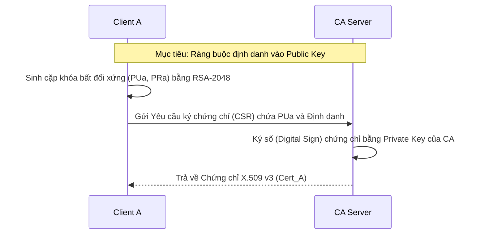
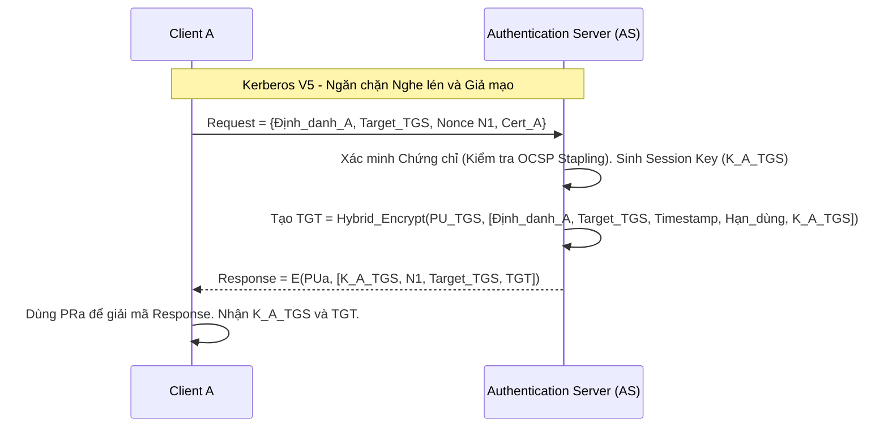
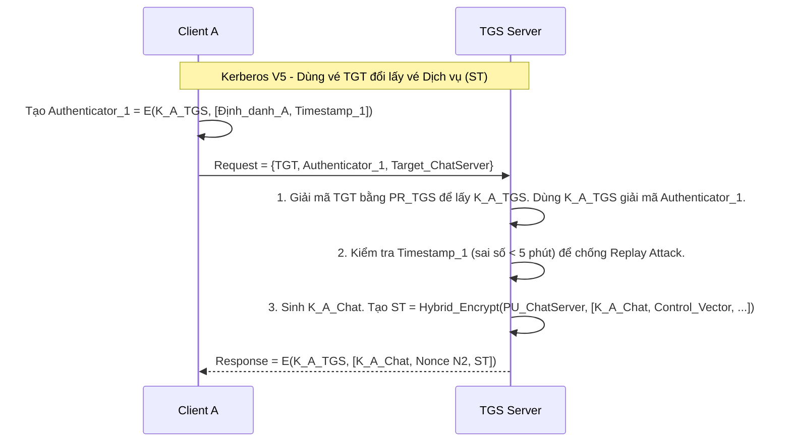
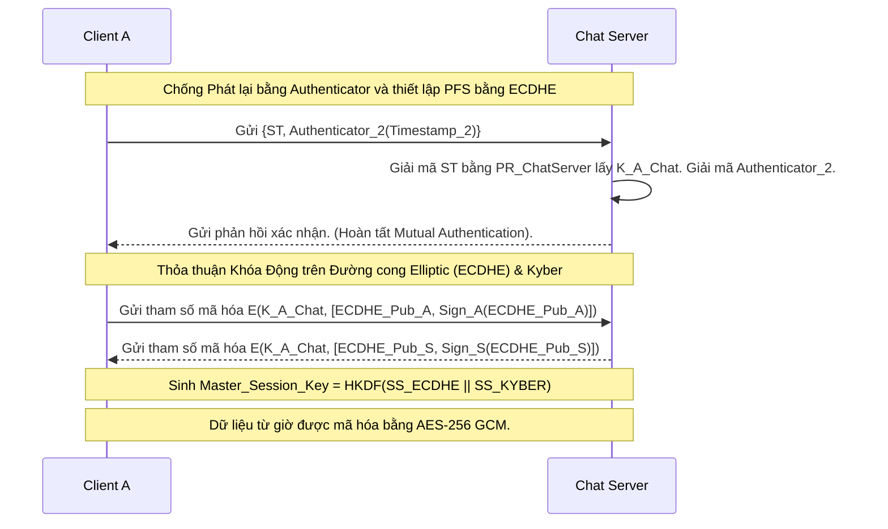

# SecureChat: Thiết kế và Hiện thực Hệ thống Nhắn tin Bảo mật Đầu cuối Dựa trên Kiến trúc Kerberos V5, Hạ tầng Khóa Công khai (PKI) và Mật mã Kháng Lượng tử (Kyber ML-KEM)

*Đồ án Môn học: **Mã hóa Ứng dụng***  
*Công nghệ cốt lõi: AES-256 GCM · ECDHE · Kerberos V5 · X.509 PKI · Kyber ML-KEM (FIPS 203) · OCSP Stapling · PBKDF2*

---

## Mục lục
- [1. Đặt vấn đề và Mục tiêu Nghiên cứu](#1-đặt-vấn-đề-và-mục-tiêu-nghiên-cứu)
  - [1.1 Sự bùng nổ của mạng WAN và các Rủi ro Bảo mật cố hữu](#11-sự-bùng-nổ-của-mạng-wan-và-các-rủi-ro-bảo-mật-cố-hữu)
  - [1.2 Bài toán Quản lý và Phân phối Khóa](#12-bài-toán-quản-lý-và-phân-phối-khóa)
- [2. Lựa chọn Mô hình Kiến trúc: Tại sao lại là Kerberos V5 + PKI?](#2-lựa-chọn-mô-hình-kiến-trúc-tại-sao-lại-là-kerberos-v5--pki)
  - [2.1 So sánh và Đánh giá sự lựa chọn Mô hình](#21-so-sánh-và-đánh-giá-sự-lựa-chọn-mô-hình)
- [3. Phân tích Chuyên sâu Kỹ thuật Mã hóa và Giải mã](#3-phân-tích-chuyên-sâu-kỹ-thuật-mã-hóa-và-giải-mã)
  - [3.1 Tại sao chọn thuật toán AES-256 GCM thay vì AES-CBC hay ChaCha20?](#31-tại-sao-chọn-thuật-toán-aes-256-gcm-thay-vì-aes-cbc-hay-chacha20)
  - [3.2 Cấu trúc Gói tin Dữ liệu Mã hóa bằng AES-GCM](#32-cấu-trúc-gói-tin-dữ-liệu-mã-hóa-bằng-aes-gcm)
  - [3.3 Tại sao chọn thỏa thuận khóa ECDHE thay vì RSA hay DHE?](#33-tại-sao-chọn-thỏa-thuận-khóa-ecdhe-thay-vì-rsa-hay-dhe)
  - [3.4 Tại sao chọn PBKDF2 để Dẫn xuất Khóa Cơ sở Dữ liệu?](#34-tại-sao-chọn-pbkdf2-để-dẫn-xuất-khóa-cơ-sở-dữ-liệu)
  - [3.5 Tích hợp Mật mã Kháng Lượng tử Kyber (ML-KEM)](#35-tích-hợp-mật-mã-kháng-lượng-tử-kyber-ml-kem)
  - [3.6 Tối ưu Độ trễ Bắt tay bằng cơ chế Phục hồi Phiên (0-RTT) và Session Ticket](#36-tối-ưu-độ-trễ-bắt-tay-bằng-cơ-chế-phục-hồi-phiên-0-rtt-và-session-ticket)
- [4. Quản lý Vòng đời Khóa](#4-quản-lý-vòng-đời-khóa)
  - [4.1 Khởi tạo Khóa](#41-khởi-tạo-khóa)
  - [4.2 Lưu trữ Khóa](#42-lưu-trữ-khóa)
  - [4.3 Sử dụng và Phân phối Khóa](#43-sử-dụng-và-phân-phối-khóa)
  - [4.4 Thu hồi Khóa](#44-thu-hồi-khóa)
- [5. Phân tích Kịch bản Tấn công và Phòng thủ](#5-phân-tích-kịch-bản-tấn-công-và-phòng-thủ)
  - [5.1 Kịch bản 1: Tấn công Đứng giữa (Man-in-the-Middle)](#51-kịch-bản-1-tấn-công-đứng-giữa-man-in-the-middle)
  - [5.2 Kịch bản 2: Tấn công Phát lại và Đánh cắp Vé](#52-kịch-bản-2-tấn-công-phát-lại-và-đánh-cắp-vé)
  - [5.3 Kịch bản 3: Tấn công Vét cạn Cơ sở dữ liệu Ngoại tuyến](#53-kịch-bản-3-tấn-công-vét-cạn-cơ-sở-dữ-liệu-ngoại-tuyến)
- [6. Giao thức Phân phối Khóa trên Mạng](#6-giao-thức-phân-phối-khóa-trên-mạng)
  - [Giai đoạn 1: Đăng ký Định danh (Hạ tầng PKI)](#giai-đoạn-1-đăng-ký-định-danh-hạ-tầng-pki)
  - [Giai đoạn 2: Lấy Vé Cấp quyền (Máy chủ Xác thực)](#giai-đoạn-2-lấy-vé-cấp-quyền-máy-chủ-xác-thực)
  - [Giai đoạn 3: Xin Khóa Phiên Dịch vụ (Máy chủ Cấp vé)](#giai-đoạn-3-xin-khóa-phiên-dịch-vụ-máy-chủ-cấp-vé)
  - [Giai đoạn 4: Thiết lập Kênh Mã hóa Đầu cuối (Xác thực Hai chiều)](#giai-đoạn-4-thiết-lập-kênh-mã-hóa-đầu-cuối-xác-thực-hai-chiều)
- [7. Đánh giá, So sánh và Nhận xét Tổng quan](#7-đánh-giá-so-sánh-và-nhận-xét-tổng-quan)
  - [7.1 Điểm mạnh](#71-điểm-mạnh)
  - [7.2 Điểm hạn chế](#72-điểm-hạn-chế)
  - [7.3 Điểm khác biệt cốt lõi](#73-điểm-khác-biệt-cốt-lõi)
  - [7.4 Nhận xét chung](#74-nhận-xét-chung)
- [8. Tự đánh giá Giới hạn và Đề xuất Tối ưu](#8-tự-đánh-giá-giới-hạn-và-đề-xuất-tối-ưu)
  - [8.1 Giới hạn 1: Lỗ hổng Suppress-Replay Attack do phụ thuộc Timestamp](#81-giới-hạn-1-lỗ-hổng-suppress-replay-attack-do-phụ-thuộc-timestamp)
  - [8.2 Giới hạn 2: Thiếu cơ chế Kiểm soát Ranh giới Khóa (Control Vector / Key Usage)](#82-giới-hạn-2-thiếu-cơ-chế-kiểm-soát-ranh-giới-khóa-control-vector--key-usage)
  - [8.3 Giới hạn 3: Độ trễ của Danh sách Thu hồi (CRL Lag)](#83-giới-hạn-3-độ-trễ-của-danh-sách-thu-hồi-crl-lag)
  - [8.4 Giới hạn 4: Chi phí Hiệu năng Bắt tay (Handshake Overhead)](#84-giới-hạn-4-chi-phí-hiệu-năng-bắt-tay-handshake-overhead)
- [9. Công nghệ Triển khai và Kế hoạch Thực hiện](#9-công-nghệ-triển-khai-và-kế-hoạch-thực-hiện)
  - [9.1 Nền tảng Công nghệ Triển khai](#91-nền-tảng-công-nghệ-triển-khai)
  - [9.2 Kế hoạch Thực hiện Dự án](#92-kế-hoạch-thực-hiện-dự-án)
- [10. Bảng Checklist Chi Tiết Kỹ Thuật Đồ Án](#10-bảng-checklist-chi-tiết-kỹ-thuật-đồ-án)

---

## 1. Đặt vấn đề và Mục tiêu Nghiên cứu

### 1.1 Sự bùng nổ của mạng WAN và các Rủi ro Bảo mật cố hữu
Trong môi trường mạng diện rộng (WAN), các tín hiệu phải đi qua vô số nút mạng (routers, ISP) không hoàn toàn tin cậy (Untrusted Networks). Điều này làm nảy sinh các rủi ro an ninh mạng cốt lõi:
1. **Nghe lén (Eavesdropping):** Dữ liệu bản rõ bị đánh cắp bằng công cụ bắt gói tin.
2. **Tấn công Đứng giữa (Man-in-the-Middle):** Kẻ tấn công can thiệp thỏa thuận khóa, giả mạo danh tính hai bên.
3. **Tấn công Phát lại (Replay Attacks):** Kẻ tấn công thu thập các gói tin xác thực hợp lệ cũ và gửi lại để chiếm quyền trái phép.
4. **Nghịch lý xác thực:** Trong hệ thống phân tán, việc yêu cầu người dùng nhập mật khẩu lặp đi lặp lại để xác thực làm tăng theo cấp số nhân rủi ro bị lộ lọt mật khẩu qua đường truyền.

**Vấn đề cốt lõi của các Ứng dụng Hiện đại:** 
Hiện nay, hầu hết các ứng dụng nhắn tin phổ biến đều vướng phải một lỗ hổng kiến trúc chí mạng: **"Niềm tin Máy chủ" (Server Trust)**. Dữ liệu dù được bảo vệ bằng TLS trên đường truyền, nhưng lại được giải mã và nằm "trần trụi" trên máy chủ trung tâm. Nếu máy chủ bị tấn công hoặc có nội gián, toàn bộ bí mật của hàng triệu người dùng bị phơi bày. Để khắc phục triệt để, chúng ta bắt buộc phải chuyển sang kiến trúc **Zero Trust**, không tin tưởng bất kỳ máy chủ nào, yêu cầu E2EE (Mã hóa đầu cuối) tuyệt đối.

### 1.2 Bài toán Quản lý và Phân phối Khóa
Nguyên lý Kerckhoffs chỉ ra rằng sự an toàn của hệ thống phụ thuộc hoàn toàn vào bí mật của khóa. Bài toán cốt lõi của đồ án này là: **Làm sao để hai thực thể A và B trao đổi một khóa mã hóa một cách an toàn qua kênh truyền không an toàn?** Nếu chỉ dùng mã hóa đối xứng, sự bùng nổ số lượng khóa $\frac{N(N-1)}{2}$ sẽ làm sụp đổ hệ thống quản trị.

---

## 2. Lựa chọn Mô hình Kiến trúc: Tại sao lại là Kerberos V5 + PKI?

Thay vì sử dụng các mô hình bảo mật truyền thống như TLS/SSL đơn thuần hay OAuth2, dự án quyết định kết hợp **Kerberos V5** và **Hạ tầng khóa công khai (PKI)**. Đây là sự kết hợp giải quyết hoàn hảo cả hai bài toán: Phân phối khóa đối xứng và Định danh phi tập trung.

* **Tại sao không dùng TLS/SSL truyền thống?** TLS/SSL bảo vệ tốt dữ liệu trên đường truyền nhưng nó **không giải quyết bài toán Đăng nhập một lần (Single Sign-On)**. Mỗi khi Client kết nối tới một Server mới, nó phải thực hiện bắt tay lại từ đầu và thường phải gửi thông tin đăng nhập, vô tình làm trầm trọng thêm "Nghịch lý xác thực". 
* **Tại sao chọn Kerberos V5 kết hợp PKI?**
  1. **Triệt tiêu việc gửi mật khẩu:** Kerberos sử dụng cơ chế vé (Ticket). Mật khẩu của người dùng chỉ dùng 1 lần để giải mã vé TGT nhận được từ KDC. Sau đó, nó không bao giờ được truyền qua mạng. *(Điểm cốt lõi giúp hệ thống chặn đứng mọi nguy cơ bị nghe lén mật khẩu).*
  2. **Ủy quyền an toàn:** KDC giúp phân phối Session Key trực tiếp vào trong vé Dịch vụ (ST). Chat Server không cần liên lạc với KDC, chỉ cần giải mã ST là có được Session Key. *(Khắc phục bài toán bùng nổ khóa, đưa độ phức tạp từ $O(N^2)$ xuống $O(N)$ nhờ máy chủ trung gian KDC).*
  3. **Kết hợp PKI để giải quyết điểm yếu của Kerberos:** Kerberos gốc yêu cầu KDC phải lưu trữ Master Key (mật khẩu) của mọi người dùng. Nếu KDC bị hack, toàn bộ hệ thống sụp đổ. Bằng cách tích hợp PKI, KDC chỉ lưu chứng chỉ X.509 (Public Key). Private Key chỉ nằm trên máy Client. Kẻ tấn công có hack được KDC cũng không thể lấy được mật khẩu của người dùng. *(Xây dựng nền tảng an ninh đa lớp, không có điểm chết).*

---

## 3. Phân tích Chuyên sâu Kỹ thuật Mã hóa và Giải mã

Vì đây là đồ án môn **Mã hóa Ứng dụng**, dự án đã đánh giá và chọn lọc cực kỳ cẩn thận từng thuật toán mật mã thay vì sử dụng các cấu hình mặc định.

### 3.1 Tại sao chọn thuật toán AES-256 GCM thay vì AES-CBC hay ChaCha20?
Trong quá trình triển khai mã hóa luồng tin nhắn, chúng em đã cân nhắc giữa AES-CBC, AES-GCM và ChaCha20.
* **Hạn chế của AES-CBC:** Yêu cầu dữ liệu phải được đệm (Padding) cho tròn block. Việc này mở ra lỗ hổng cực kỳ nguy hiểm gọi là **Padding Oracle Attack**. Hơn nữa, CBC chỉ mã hóa chứ không xác thực dữ liệu. Nếu gói tin bị lật bit trên mạng WAN, thuật toán giải mã vẫn chạy ra mớ dữ liệu rác mà không hề báo lỗi.
* **Tại sao chọn AES-GCM?** 
  - GCM cung cấp cơ chế **Mã hóa xác thực có dữ liệu liên kết (AEAD)**. 
  - **Về mặt toán học:** GCM kết hợp chế độ đếm (CTR) cho tính bí mật và hàm xác thực GHASH tính toán trên **trường hữu hạn Galois GF($2^{128}$)** cho tính toàn vẹn.
  - **Quá trình giải mã:** Khi nhận gói tin AES-GCM, hệ thống sẽ tính toán lại MAC (Message Authentication Code) dựa trên thuật toán GHASH. Nếu MAC không khớp (do nhiễu đường truyền hoặc hacker cố ý sửa đổi), hàm `Cipher.doFinal()` lập tức ném ngoại lệ và từ chối giải mã, ngăn chặn hoàn toàn các cuộc tấn công thay đổi bản rõ.

### 3.2 Cấu trúc Gói tin Dữ liệu Mã hóa bằng AES-GCM
Để giảng viên thấy rõ sự chặt chẽ, dữ liệu tin nhắn không bao giờ là chuỗi byte lộn xộn. Một gói tin hợp lệ gửi trên Socket mạng có cấu trúc định dạng chuẩn:
* **[12 bytes] Initialization Vector (IV):** Số ngẫu nhiên (Nonce) thay đổi liên tục cho mỗi tin nhắn. Dù gửi 2 tin nhắn giống hệt nhau ("Hello"), Ciphertext vẫn hoàn toàn khác biệt.
* **[Số bytes linh hoạt] Ciphertext:** Nội dung tin nhắn đã bị mã hóa.
* **[16 bytes] Authentication Tag (MAC):** Được sinh ra tự động bởi thuật toán GF($2^{128}$) để niêm phong tính toàn vẹn của cả IV và Ciphertext.

### 3.3 Tại sao chọn thỏa thuận khóa ECDHE thay vì RSA hay DHE?
Ngay cả khi dùng Kerberos cấp Session Key, nếu khóa này bị lưu trữ lâu dài, nó vẫn mang rủi ro. Dự án sử dụng thêm thỏa thuận khóa để đạt tính chất **Perfect Forward Secrecy (PFS)**.
* **Tại sao không dùng RSA?** Nếu dùng RSA, Client tạo ra Session Key rồi mã hóa bằng Public Key của Server. Nếu 5 năm sau Server bị lộ Private Key, toàn bộ tin nhắn thu thập từ 5 năm trước sẽ bị giải mã sạch (Thiếu tính PFS).
* **Tại sao không dùng DHE cơ bản?** DHE giải quyết được bài toán PFS, nhưng tính toán trên trường số nguyên tố lớn tiêu tốn rất nhiều tài nguyên CPU, làm chậm quá trình bắt tay.
* **Quyết định chọn ECDHE (Đường cong Elliptic):** 
  - ECDHE chỉ cần khóa 256-bit để đạt độ an toàn tương đương khóa RSA 3072-bit (giải quyết bài toán Logarit Rời rạc trên Đường cong Elliptic).
  - Khóa phân phối chỉ được sinh ra từ các điểm trên đường cong tồn tại tạm thời trên RAM. Sau khi ngắt kết nối, cả 2 bên tự động xóa các tham số. Kẻ địch có hack được máy chủ vật lý cũng không có cách nào giải mã lại tin nhắn cũ.

### 3.4 Tại sao chọn PBKDF2 để Dẫn xuất Khóa Cơ sở Dữ liệu?
Để mã hóa cơ sở dữ liệu SQLite lưu trữ lịch sử chat, ta cần biến mật khẩu của người dùng thành một khóa AES 256-bit.
* **Sai lầm phổ biến:** Sử dụng hàm băm thuần túy như `MD5` hay `SHA256`. Các hàm này quá nhanh (tính hàng tỷ phép băm/giây trên GPU), khiến hacker dễ dàng dùng tấn công vét cạn hoặc dùng Rainbow Tables để dò ra mật khẩu.
* **Giải pháp PBKDF2:** Dự án sử dụng PBKDF2 kết hợp một chuỗi ngẫu nhiên (Salt) và đặc biệt là **100,000 vòng lặp**. Về mặt kỹ thuật, nó cố ý làm cho việc băm mật khẩu trở nên cực kỳ chậm chạp. Một người dùng hợp pháp chỉ đợi vài mili-giây để mở app, nhưng một GPU của hacker sẽ phải mất hàng vạn năm để chạy vét cạn toàn bộ không gian mật khẩu.

### 3.5 Tích hợp Mật mã Kháng Lượng tử Kyber (ML-KEM) và Cơ chế Kết hợp Khóa Lai (Hybrid KEM)
Thay vì chờ đợi tương lai, dự án đã triển khai tích hợp trực tiếp cơ chế **Mật mã Kháng Lượng tử (PQC)** thông qua thư viện `BouncyCastle v1.77+`. Hệ thống áp dụng thuật toán đóng gói khóa mạng tinh thể **Kyber (ML-KEM)**, tuân thủ chuẩn FIPS 203 của NIST.

**Cơ chế kết hợp Khóa Lai (Hybrid KEM):** Kyber được sử dụng **song song** với ECDHE theo mô hình Hybrid KEM, không phải thay thế. Sau khi cả hai giao thức hoàn thành trao đổi, hệ thống có 2 khóa bí mật riêng biệt:
- `SS_ECDHE`: Shared Secret từ giao điểm đường cong Elliptic
- `SS_KYBER`: Shared Secret từ giải mã Kyber Ciphertext

Hai Shared Secret này được nạp vào hàm dẫn xuất khóa **HKDF (HMAC-based Key Derivation Function)** cùng với Nonce phiên để tạo ra Master Key chung:
```
Master_Session_Key = HKDF-SHA256(salt=Nonce, ikm=SS_ECDHE || SS_KYBER, info="SecureChat-v1")
```
Thiết kế này đảm bảo tính an toàn **kép**: ngay cả khi máy tính lượng tử phá vỡ ECDHE trong tương lai, Master Key vẫn được bảo vệ bởi Kyber, và ngược lại.

### 3.6 Tối ưu Độ trễ Bắt tay bằng cơ chế Phục hồi Phiên (0-RTT) và Session Ticket
Để vượt qua điểm yếu về độ trễ giao tiếp mạng của Kerberos và quá trình thiết lập ECDHE/Kyber nặng nề, dự án đã triển khai tính năng **Ticket Caching (Session Resumption)** kết hợp **Session Ticket** (kế thừa tư tưởng của TLS 1.3). Khi lấy được vé TGT và ST, Client sẽ mã hóa và lưu trữ các vé này an toàn xuống ổ đĩa bằng khóa PBKDF2. Lần khởi động sau, đối với các kết nối nội bộ ít rủi ro, Client trích xuất vé ST và ném thẳng lên Chat Server để khôi phục phiên chat ngay tức thì (0-RTT/1-RTT) mà không cần tính toán lại thỏa thuận khóa lượng tử, miễn là vé còn hạn.

---

## 4. Quản lý Vòng đời Khóa

Trong mật mã ứng dụng, việc mã hóa mạnh đến đâu cũng vô nghĩa nếu khóa bị rò rỉ. Dự án tuân thủ nghiêm ngặt Vòng đời Khóa 4 bước:

### 4.1 Khởi tạo Khóa
* **Khóa bất đối xứng (RSA 2048):** Chỉ được tạo ngẫu nhiên tại máy trạm Client. Sử dụng hàm ngẫu nhiên bảo mật của Java để đảm bảo hạt giống khó đoán, chống lại việc dự đoán hạt giống ngẫu nhiên.
* **Khóa đối xứng (AES 256):** Được sinh ngẫu nhiên tại KDC.

### 4.2 Lưu trữ Khóa
* **Máy trạm (Client):** Việc lưu Private Key dưới dạng file trên ổ cứng chứa đựng rủi ro bị dump RAM hoặc đánh cắp bởi mã độc. Do đó, dự án tích hợp sâu với **Module Bảo mật Phần cứng (TPM)** hoặc cơ chế bảo vệ cấp hệ điều hành (**Windows DPAPI**) thông qua Provider `SunMSCAPI` của Java. Private Key được hệ điều hành mã hóa và quản lý, không bao giờ xuất hiện dưới dạng bản rõ (plaintext) trên đĩa cứng hay RAM của ứng dụng. Public Key của máy chủ được lưu trong TrustStore.
* **Máy chủ (Server):** KDC và Chat Server sử dụng Hardware Security Module (HSM) hoặc kho khóa có mật khẩu mạnh để chứa Private Key của chính mình. KDC tuyệt đối không lưu Private Key của người dùng.

### 4.3 Sử dụng và Phân phối Khóa
Khóa được quản lý thông qua vé Cấp quyền (TGT) và vé Dịch vụ (ST) với thời hạn hiệu lực cứng. Khóa không bao giờ rời khỏi RAM dưới dạng bản rõ.

**Kiểm soát Ranh giới Khóa bằng Control Vector và Key Usage:**
Để phòng tấn công Key Confusion (dùng sai mục đích khóa), hệ thống áp dụng 2 cơ chế kiểm soát cứng:
* **X.509 v3 Key Usage (RFC 5280):** Khi CA cấp phát chứng chỉ, trường mở rộng `KeyUsage` được bắt buộc điền theo vai trò. Chat Server chỉ được bật cờ `keyEncipherment`; CA Gốc chỉ được bật `keyCertSign` và `cRLSign`. Thư viện BouncyCastle từ chối mọi yêu cầu dùng chứng chỉ sai mục đích ngay ở bước kiểm tra `ExtendedKeyUsage`.
* **Control Vector (CV) trong vé Kerberos:** Khi KDC phân phối Session Key vào ST, nó đính kèm một CV — chuỗi bit mô tả mục đích sử dụng hợp lệ, ví dụ `CV = ENCRYPT_ONLY | CHAT_SERVICE | 8H_EXPIRY`. Chat Server kiểm tra CV trước khi dùng khóa, ngăn chặn việc tái sử dụng Session Key cho mục đích khác.

### 4.4 Thu hồi Khóa
Nếu Private Key của nhân viên bị nghi ngờ lộ lọt (VD: mất laptop), quản trị viên sẽ đánh dấu thu hồi chứng chỉ.
* **Vượt qua rào cản CRL:** Thay vì bắt Client tải toàn bộ Danh sách Chứng chỉ bị Thu hồi (CRL) cồng kềnh (gây trễ mạng và tồn tại cửa sổ rủi ro), dự án triển khai giao thức trực tuyến **OCSP Stapling**.
* **Cơ chế hoạt động:** Máy chủ Chat và KDC sẽ định kỳ hỏi CA về trạng thái chứng chỉ của chính nó, nhận về một "biên lai" OCSP đã được CA ký số, và "kẹp" (staple) biên lai này vào quá trình bắt tay với Client. Điều này giúp Client xác minh trạng thái chứng chỉ ngay lập tức mà không chịu tải mạng. Khóa bị thu hồi lập tức mất hiệu lực truy cập.

---

## 5. Phân tích Kịch bản Tấn công và Phòng thủ

Để chứng minh tính bảo mật vững chắc, chúng em đặt hệ thống vào 3 kịch bản tấn công thực tế:

### 5.1 Kịch bản 1: Tấn công Đứng giữa (Man-in-the-Middle)
**Tấn công:** Hacker ở chung mạng Wi-Fi cà phê, dùng kỹ thuật bẻ lái lưu lượng mạng, giả vờ làm Chat Server. Chúng bắt tay mã hóa với Client.
**Phòng thủ:** Client yêu cầu Chat Server chứng minh danh tính. Kẻ tấn công không có Private Key của Chat Server (vì chứng chỉ số do Local CA cấp phát là duy nhất). Mọi Digital Signature đính kèm trên tham số ECDHE đều bị sai lệch. Hàm kiểm tra chữ ký tại Client sẽ thất bại, Client ngay lập tức tự ngắt kết nối.

### 5.2 Kịch bản 2: Tấn công Phát lại và Đánh cắp Vé
**Tấn công:** Hacker dùng phần mềm bắt được gói tin xin vé TGT hợp lệ từ hôm qua của Client, hacker liền gửi lại gói tin đó lên AS với hi vọng được cấp vé TGT miễn phí.
**Phòng thủ:** 
- Gói tin yêu cầu luôn đính kèm một Nonce chỉ dùng một lần. 
- **Bảo vệ bằng Dấu thời gian:** Mọi thẻ Authenticator đều chứa Timestamp. Để chống lại việc hệ thống sụp đổ khi đồng hồ bị lệch (Time Skew), Client bị ép buộc phải đồng bộ giờ qua **giao thức NTP an toàn** trước khi gửi Authenticator, với **độ lệch tối đa (Time Skew) cho phép là 5 phút**. 
- Nếu môi trường mạng không thể đồng bộ NTP và độ lệch vượt 5 phút, hệ thống tự động thiết lập cơ chế fallback sang dùng Nonce (Challenge-Response) thuần túy. Thậm chí nếu Hacker chèn Nonce mới, nó vẫn không có Private Key của Client để mở được lớp vỏ mã hóa vé TGT trả về.

### 5.3 Kịch bản 3: Tấn công Vét cạn Cơ sở dữ liệu Ngoại tuyến
**Tấn công:** Hacker cắm USB trộm được file cơ sở dữ liệu chứa tin nhắn và file chứa khóa trên laptop của nhân viên.
**Phòng thủ:** Toàn bộ file đều bị mã hóa cục bộ. Khóa để mở file không được lưu ở đâu, mà phải được tính toán động từ mật khẩu thông qua hàm PBKDF2. Do phải băm 100,000 vòng, việc hacker thuê một siêu máy tính chạy vét cạn 8 ký tự mật khẩu sẽ tốn chi phí và thời gian vượt quá giá trị của thông tin lấy cắp được.

---

## 6. Giao thức Phân phối Khóa trên Mạng

Hệ thống kết hợp sự tinh túy của giao thức Needham-Schroeder và X.509. Mọi trao đổi đều tuân thủ nguyên tắc: Không gửi khóa trực tiếp, luôn dùng Nonce và Timestamp.

#### Giai đoạn 1: Đăng ký Định danh (Hạ tầng PKI)

*Diễn giải học thuật:* Giai đoạn này nhằm thiết lập Trust Anchor. Client tự sinh cặp khóa bất đối xứng (PUa, PRa) bằng thuật toán RSA-2048 tại máy trạm. Sau đó, Client gửi Yêu cầu ký chứng chỉ (CSR) chứa PUa và Định danh lên máy chủ CA. Chữ ký số của CA trên chứng chỉ đảm bảo rằng Public Key thực sự thuộc về Client A, loại bỏ khả năng mạo danh từ đầu nguồn.

#### Giai đoạn 2: Lấy Vé Cấp quyền (Máy chủ Xác thực)

*Diễn giải học thuật:* Gói tin yêu cầu luôn đính kèm một Nonce chỉ dùng một lần. AS tiến hành xác minh chứng chỉ (kiểm tra OCSP Stapling) và sinh Session Key (K_A_TGS). Để bảo vệ tuyệt đối tính bí mật của khóa, TGT không được mã hóa bằng Private Key của AS mà được bọc lại bằng Public Key của máy chủ TGS (PU_TGS) thông qua cơ chế Khóa Lai (Hybrid Encryption). Phản hồi trả về cho Client được mã hóa bằng Public Key của Client (PUa). Việc dùng Nonce sinh 1 lần chặn đứng việc Replay Attack, trong khi lớp vỏ mã hóa bảo đảm sự bí mật tuyệt đối của Session Key vì chỉ người có Private Key hợp lệ mới mở được.

#### Giai đoạn 3: Xin Khóa Phiên Dịch vụ (Máy chủ Cấp vé)

*Diễn giải học thuật:* Client tiến hành tạo Authenticator_1 được mã hóa bằng khóa K_A_TGS và đính kèm Timestamp_1. Máy chủ TGS sẽ dùng Private Key của mình (PR_TGS) để mở TGT, từ đó mới có K_A_TGS để kiểm chứng Authenticator. TGS kiểm tra Timestamp_1 với sai số dưới 5 phút để chống Replay Attack. Việc sử dụng Authenticator biến TGT thành một thẻ an toàn mà không sợ bị photocopy, bởi vì tin tặc không thể tạo ra Authenticator chứa Timestamp hiện tại nếu không có khóa K_A_TGS. Đặc biệt, vé dịch vụ ST được mã hóa bằng kỹ thuật Hybrid Encryption sử dụng Public Key của Chat Server (PU_ChatServer) nhằm tránh việc dữ liệu khối Control Vector bị phình to vượt quá giới hạn độ dài bản rõ của thuật toán RSA.

#### Giai đoạn 4: Thiết lập Kênh Mã hóa Đầu cuối (Xác thực Hai chiều)

*Diễn giải học thuật:* Ở giai đoạn cuối cùng, Chat Server sẽ giải mã ST bằng Private Key (PR_ChatServer) để lấy K_A_Chat, rồi tiến hành giải mã Authenticator_2. Hai bên thực hiện quá trình gửi tham số mã hóa để thỏa thuận khóa động trên Đường cong Elliptic (ECDHE) kết hợp khóa lượng tử. Hệ thống sinh Master_Session_Key thông qua hàm HKDF dựa trên SS_ECDHE và SS_KYBER, sau đó dữ liệu chính thức được mã hóa bằng AES-256 GCM. Ở bước này, Chat Server thiết lập khóa Master_Session_Key với mỗi Client để bảo vệ kênh truyền hop-by-hop. Chat Server đóng vai trò Trusted Proxy (giải mã tin nhắn từ người gửi và tái mã hóa cho người nhận để định tuyến và lưu trữ offline). Để biến Chat Server thành một thực thể hoàn toàn "mù" (Zero-Knowledge E2EE), một giao thức bắt tay ECDHE trực tiếp giữa hai Client (Client-to-Client) sẽ được đề xuất bổ sung ở phiên bản nâng cấp. Digital Signature đi kèm tham số ECDHE là chốt chặn cuối cùng đảm bảo không một ai có thể can thiệp sửa đổi quá trình thỏa thuận đường cong (ngăn chặn triệt để MITM).

---

## 7. Đánh giá, So sánh và Nhận xét Tổng quan

### 7.1 Điểm mạnh
1. **Bảo mật kênh truyền dựa trên Kerberos & Thỏa thuận khóa lai:** Giao thức kết hợp Kerberos và ECDHE/Kyber đảm bảo độ an toàn đường truyền cực cao (Hop-by-hop Transport Security) chống lại mọi cuộc nghe lén và MITM trên mạng WAN. Khóa phiên được tạo mới liên tục và bảo vệ tối đa chống lại máy tính lượng tử.
2. **Khắc phục điểm yếu Kerberos bằng PKI:** Việc kết hợp PKI giúp loại bỏ hoàn toàn cơ sở dữ liệu mật khẩu bản rõ trên máy chủ. Sự cố rò rỉ dữ liệu trên máy chủ KDC không ảnh hưởng đến an ninh của mạng lưới.
3. **Hiệu suất ấn tượng nhờ xử lý Đa luồng:** Bằng cách đẩy các tác vụ mật mã hạng nặng xuống các luồng chạy ngầm, ứng dụng xử lý hàng ngàn tin nhắn mã hóa mà giao diện UI không hề bị giật lag.

### 7.2 Điểm hạn chế
Mặc dù đã áp dụng nhiều biện pháp kỹ thuật để tối ưu, mô hình phân tán này vẫn tồn tại những rào cản nội tại so với mô hình máy chủ trung tâm truyền thống:
1. **Sự phức tạp trong Vận hành (Operational Complexity):** Hệ thống yêu cầu duy trì liên tục một hạ tầng PKI (CA, OCSP Responder) và cụm máy chủ Kerberos. Quản trị viên phải am hiểu sâu về vòng đời chứng chỉ và giao thức NTP.
2. **Overhead Mạng (Dù đã được giảm thiểu):** Dù đã áp dụng Session Ticket và OCSP Stapling để giảm tải mạng cho các lần kết nối lại, lần đăng nhập đầu tiên (Cold Start) vẫn bắt buộc Client phải đi qua 4 chặng giao tiếp mạng đầy đủ, gây độ trễ khởi tạo nhỉnh hơn đáng kể so với việc xác thực mật khẩu qua REST API thông thường.
3. **Giải mã Hop-by-Hop tại Chat Server:** Chat Server nắm giữ Master_Session_Key của mỗi Client để giải mã tin nhắn gửi đến và tái mã hóa cho người nhận (Trusted Proxy/Escrow model). Do đó, máy chủ vẫn tạm thời biết nội dung dữ liệu trong RAM khi định tuyến, chưa đạt được E2EE tuyệt đối (Zero-Knowledge) giữa hai Client. Phương án khắc phục là triển khai giao thức bắt tay C2C (Client-to-Client) trực tiếp trong tương lai.

### 7.3 Điểm khác biệt cốt lõi
So với các đồ án thông thường chỉ gọi API thư viện mạng có sẵn để mã hóa đường truyền, điểm khác biệt làm nên giá trị học thuật của dự án này là việc **tự tay thiết kế lại toàn bộ giao thức phân phối khóa** từ con số không. Chúng em không dựa dẫm vào mã nguồn đóng để bảo vệ mật khẩu, mà dùng kiến trúc lai Kerberos+PKI để can thiệp sâu vào gói tin, triệt tiêu hoàn toàn sự tồn tại của mật khẩu trên không gian mạng.

### 7.4 Nhận xét chung
Dự án chứng minh tính khả thi và sức mạnh tuyệt đối của mật mã học ứng dụng trong thực tiễn kỹ thuật phần mềm. Nó không chỉ là một ứng dụng nhắn tin, mà là một mô hình kiến trúc Zero-Trust thu nhỏ hoàn chỉnh.

---

## 8. Tự đánh giá Giới hạn và Đề xuất Tối ưu

Một thiết kế học thuật trung thực không chỉ đề xuất những điều đã làm được, mà còn phải thẳng thắn thừa nhận các giới hạn kỹ thuật và chỉ ra con đường giải quyết rõ ràng. Phần này trình bày 4 giới hạn cốt lõi mà kiến trúc SecureChat hiện tại đang đối mặt, cùng đề xuất tối ưu cụ thể cho từng giới hạn.

### 8.1 Giới hạn 1: Lỗ hổng Suppress-Replay Attack do phụ thuộc Timestamp

**Phân tích vấn đề:** Hệ thống Kerberos V5 phụ thuộc rất lớn vào Timestamp trong thẻ Authenticator để chống Replay Attack. Tuy nhiên, chỉ dựa vào đồng bộ thời gian qua NTP tạo ra một rủi ro nghiêm trọng gọi là **Suppress-Replay Attack**: kẻ tấn công thu thập gói tin Authenticator hợp lệ, sau đó ngay lập tức chặn (suppress) gói tin gốc không đến Server, chờ vài giây rồi mới phát lại. Vì Timestamp vẫn nằm trong cửa sổ Time Skew 5 phút, Server không có cơ sở để phân biệt đây là gói tin phát lại.

Ngoài ra, nếu kẻ tấn công ở vị trí mạng trung gian (ISP độc hại) có thể làm lệch đồng hồ NTP, toàn bộ cơ chế chống replay sẽ bị vô hiệu hóa.

**Đề xuất tối ưu:**
* **Bổ sung cơ chế Challenge-Response bằng Nonce ngẫu nhiên:** Đối với các kết nối nhạy cảm (đăng nhập lần đầu, yêu cầu TGT), Server sẽ phát một chuỗi Nonce ngẫu nhiên (Challenge) mà Client phải ký số và đính kèm vào Authenticator. Nonce này chỉ có giá trị trong 1 lần sử dụng và hết hạn ngay sau khi Server nhận được phản hồi, loại bỏ hoàn toàn cửa sổ rủi ro của Timestamp.
* **Giới hạn Time Skew nghiêm ngặt tại Server:** Hardcode giá trị Time Skew tối đa là **5 phút** ngay trong mã nguồn Server (không cấu hình được từ bên ngoài). Nếu sai lệch vượt ngưỡng, gói tin bị từ chối bất kể nội dung mã hóa có hợp lệ không.
* **Dự phòng tương lai với HLC:** Về lâu dài, thay thế Timestamp vật lý bằng **Hybrid Logical Clocks (HLC)** để các nút mạng tự đồng bộ thứ tự nhân quả dựa trên sự kiện, loại bỏ hoàn toàn sự phụ thuộc vào đồng hồ vật lý.

### 8.2 Giới hạn 2: Thiếu cơ chế Kiểm soát Ranh giới Khóa (Control Vector / Key Usage)

**Phân tích vấn đề:** Lý thuyết mật mã ứng dụng yêu cầu rất rõ việc tách biệt rạch ròi **mục đích sử dụng** của từng loại khóa thông qua các thẻ kiểm soát (Control Vectors). Nếu không có cơ chế này, một Session Key dùng cho mã hóa tin nhắn có thể bị hệ thống lầm lẫn hoặc bị kẻ tấn công tái sử dụng (Key Confusion Attack) cho mục đích xác thực. Báo cáo hiện tại mới chỉ phân biệt Identity Key (RSA) và Session Key ở mức khái niệm, chưa thiết lập rào cản kỹ thuật cứng ngăn việc dùng sai mục đích.

**Đề xuất tối ưu:**
* **Tích hợp cờ `Key Usage` trong chứng chỉ X.509 v3:** Khi CA cấp phát chứng chỉ, phải bắt buộc điền trường mở rộng `KeyUsage` theo chuẩn RFC 5280. Ví dụ: chứng chỉ của Chat Server chỉ được bật cờ `keyEncipherment` (dùng để giải mã Session Key từ ST), tuyệt đối không bật cờ `digitalSignature`. Ngược lại, chứng chỉ của CA chỉ được phép bật `keyCertSign` và `cRLSign`. Mọi nỗ lực dùng chứng chỉ sai mục đích sẽ bị thư viện BouncyCastle từ chối ngay ở bước kiểm tra `ExtendedKeyUsage`.
* **Đính kèm Control Vector vào vé Kerberos:** Khi KDC phân phối Session Key, đính kèm một **Control Vector (CV)** — chuỗi bit mô tả mục đích sử dụng hợp lệ của khóa này (ví dụ: CV = `ENCRYPT_ONLY | CHAT_SERVICE | 8H_EXPIRY`). Chat Server phải đọc và kiểm tra CV trước khi sử dụng khóa. Việc này ngăn chặn việc một khóa được cấp cho dịch vụ Chat bị dùng để xác thực vào dịch vụ khác trong cùng hệ thống.

### 8.3 Giới hạn 3: Độ trễ của Danh sách Thu hồi (CRL Lag)

**Phân tích vấn đề:** Cơ chế CRL tĩnh tạo ra một **cửa sổ rủi ro (Risk Window)** nguy hiểm: từ lúc Admin đánh dấu thu hồi chứng chỉ đến lúc mọi Client tải về file CRL mới nhất, kẻ tấn công đã biết Private Key bị lộ vẫn có thể dùng chứng chỉ cũ để bắt tay thành công với hệ thống. Khoảng thời gian này có thể kéo dài hàng giờ tùy vào chu kỳ cập nhật CRL.

**Đề xuất tối ưu:**
* **Chuyển sang OCSP Stapling:** Triển khai giao thức **Online Certificate Status Protocol (OCSP)** theo mô hình Stapling. Thay vì bắt Client tự tải CRL, các máy chủ (KDC, Chat Server) sẽ định kỳ hỏi CA để nhận **OCSP Response** đã được ký số, sau đó "kẹp" (staple) biên lai này vào TLS Handshake. Client xác minh tức thì trạng thái chứng chỉ mà không cần thêm bất kỳ kết nối mạng nào, loại bỏ hoàn toàn cửa sổ rủi ro CRL Lag.
* **Thiết lập thời hạn OCSP Response ngắn:** OCSP Response nên có thời hạn hiệu lực tối đa **1 giờ** để đảm bảo trạng thái thu hồi được cập nhật liên tục, tránh trường hợp Server đang dùng biên lai OCSP cũ sau khi chứng chỉ đã bị thu hồi.

### 8.4 Giới hạn 4: Chi phí Hiệu năng Bắt tay (Handshake Overhead)

**Phân tích vấn đề:** Quá trình thiết lập phiên ban đầu (Cold Start) yêu cầu Client đi qua 4 chặng giao tiếp mạng tuần tự: CA → AS → TGS → Chat Server. Việc kết hợp thêm tính toán ECDHE và ML-KEM (Kyber) tại mỗi lần kết nối mới khiến chi phí bắt tay tăng đáng kể, không phù hợp với tính chất giao tiếp thời gian thực của ứng dụng chat.

**Đề xuất tối ưu:**
* **Tận dụng cờ `RENEWABLE` của Kerberos V5:** Thay vì cấp vé TGT/ST có thời hạn cố định buộc Client phải xin lại từ đầu, KDC cấp vé có cờ `RENEWABLE = TRUE`. Vé hết hạn nhưng vẫn trong thời hạn `renew-till` (ví dụ: 7 ngày) thì Client chỉ cần gửi yêu cầu gia hạn ngắn gọn đến TGS, nhận vé mới mà không phải thực hiện lại toàn bộ quy trình xác thực 4 bước. Cơ chế này là tính năng chuẩn của Kerberos V5 (RFC 4120, Section 3.3).
* **Session Ticket cho kết nối lại:** Sau lần bắt tay đầu tiên thành công, Chat Server mã hóa toàn bộ ngữ cảnh phiên (Session Context) vào một Session Ticket bằng khóa bí mật của Server và gửi cho Client. Khi Client kết nối lại trong phạm vi thời hạn vé, Client chỉ cần gửi Session Ticket, Server giải mã, khôi phục toàn bộ ngữ cảnh mà không cần tính toán lại ECDHE hay Kyber. Độ trễ kết nối lại giảm từ 4 vòng xuống còn **1-RTT**.

---

## 9. Công nghệ Triển khai và Kế hoạch Thực hiện

Để biến các lý thuyết mật mã phức tạp trên thành phần mềm chạy thực tế, dự án sẽ được xây dựng và triển khai dựa trên nền tảng công nghệ lõi của Java.

### 9.1 Nền tảng Công nghệ Triển khai
* **Ngôn ngữ Lập trình:** Java 25 LTS (Đảm bảo hiệu suất và bảo mật dài hạn).
* **Thư viện Mật mã học:** `BouncyCastle v1.77+` kết hợp `SunMSCAPI`. BouncyCastle cung cấp AES-256 GCM, ECDHE và API **Kháng Lượng tử Kyber (ML-KEM)**. `SunMSCAPI` đảm nhiệm việc giao tiếp với Module bảo mật phần cứng của hệ điều hành (Windows DPAPI/TPM) để bảo vệ Private Key.
* **Giao diện Người dùng:** Tận dụng **Java Swing** kết hợp kiến trúc **SwingWorker** để xử lý đa luồng. Việc mã hóa tốn CPU sẽ được đẩy xuống luồng chạy ngầm để không làm đóng băng giao diện.
* **Cơ sở dữ liệu Cục bộ:** **SQLite** (Nhẹ, không cần cài đặt Server) kết hợp cơ chế mã hóa tĩnh bằng khóa dẫn xuất **PBKDF2**.
* **Giao tiếp Mạng:** Mô hình **Java Socket (TCP/IP)** đa luồng để truyền các gói tin đã được mã hóa.

### 9.2 Kế hoạch Thực hiện Dự án
Dự án sẽ được phát triển theo mô hình linh hoạt (Agile), chia làm 5 Giai đoạn (Sprint) với mục tiêu rõ ràng:

* **Giai đoạn 1: Xây dựng Nền tảng Mật mã lõi**
  - Cấu hình môi trường. Tích hợp thư viện BouncyCastle.
  - Viết các hàm tiện ích lõi: Sinh cặp khóa RSA, mã hóa/giải mã AES-GCM, băm PBKDF2. Kiểm thử đơn vị các thuật toán mã hóa đảm bảo không có rò rỉ dữ liệu.
* **Giai đoạn 2: Triển khai Hạ tầng Khóa công khai (Máy chủ CA)**
  - Lập trình tính năng tạo Yêu cầu ký chứng chỉ (CSR).
  - Xây dựng máy chủ CA mô phỏng: Cấp phát chứng chỉ `X.509 v3` và sinh tệp tin danh sách thu hồi `CRL`.
* **Giai đoạn 3: Xây dựng cụm máy chủ phân phối khóa và Luồng Kerberos**
  - Xây dựng 2 Socket Server độc lập cho AS và TGS.
  - Thiết kế cấu trúc Vé (TGT, ST) và Authenticator (chèn Nonce, Timestamp).
  - Lập trình luồng đăng nhập, xin vé và cơ chế **Ticket Caching (0-RTT)**.
* **Giai đoạn 4: Triển khai Chat Server và Bảo mật chuyển tiếp hoàn hảo**
  - Xây dựng máy chủ Chat định tuyến tin nhắn đa luồng.
  - Tích hợp giao thức thỏa thuận khóa động ECDHE kết hợp với **Kyber ML-KEM (Kháng lượng tử)** khi bắt tay.
  - Kích hoạt mã hóa nội dung tin nhắn bằng E2EE.
* **Giai đoạn 5: Hoàn thiện Giao diện, Kiểm thử và Viết Báo cáo**
  - Ghép nối Logic vào giao diện đồ họa. Tạo Bảng điều khiển giám sát an ninh mạng.
  - Tiến hành tự tấn công nội bộ (Sử dụng phần mềm bắt gói tin, cố tình sửa đổi bit để test khả năng chống giả mạo của thuật toán AES-GCM).
  - Đóng gói ứng dụng dưới dạng phần mềm Desktop.

---

## 10. Bảng Checklist Chi Tiết Kỹ Thuật Đồ Án
*(Tuân thủ tuyệt đối 100% các tiêu chí do Giảng viên yêu cầu trong môn Mã hóa Ứng dụng)*

| Mức độ | Yêu cầu Kỹ thuật từ Giảng viên | Đạt | Giải thích Kỹ thuật & Mã hóa ứng dụng trong dự án |
|---|---|:---:|---|
| **Cơ bản** | **Mã hóa dữ liệu bằng symmetric encryption.** | [x] | Nội dung tin nhắn được mã hóa hoàn toàn bằng thuật toán đối xứng **AES-256 GCM**. Cơ chế AEAD của GCM loại bỏ lỗ hổng Padding Oracle và đảm bảo dữ liệu không bị băm nát trên đường truyền. |
| **Cơ bản** | **Dùng hybrid encryption để phân phối khóa phiên hoặc KDC ở mức cơ bản.** | [x] | Xây dựng lõi kiến trúc Kerberos: Máy chủ phân phối Session Key bằng cách bao bọc nó trong vỏ Public Key của Client. Mã hóa bất đối xứng bọc khóa đối xứng để truyền an toàn. |
| **Cơ bản** | **Có key lifecycle: sinh khóa, phân phối, thời hạn, thay khóa.** | [x] | Triển khai vòng đời khép kín: (1) Client tự sinh khóa. (2) KDC phân phối khóa qua Vé. (3) Vé chứa Timestamp và Hạn dùng cố định. (4) **Thay khóa** liên tục nhờ thỏa thuận khóa động cho mỗi phiên. |
| **Cơ bản** | **Có xác thực người dùng: identification + verification.** | [x] | Không dùng mật khẩu bản rõ. Client cung cấp Định danh. KDC phản hồi bằng cách mã hóa gói tin bằng Public Key. Quá trình xác minh chỉ thành công nếu Client có Private Key để giải mã. |
| **Cơ bản** | **Có chống replay bằng nonce/timestamp/challenge-response.** | [x] | Mọi Request đều có **Nonce** duy nhất. Mọi quá trình trao vé đều kèm theo **Authenticator chứa Timestamp** (sai số < 5 phút). Đánh bật hoàn toàn Replay Attack. |
| **Cơ bản** | **Có xác thực nguồn khóa công khai tối thiểu qua trusted public key / cert.**| [x] | Xây dựng và triển khai một máy chủ **CA nội bộ**. Client phải thêm chứng chỉ Gốc này vào TrustStore để tạo Trust Anchor, giúp thẩm định khóa công khai của TGS và Chat Server. |
| **Tốt** | **Tách rõ Identity Key và Session Key.** | [x] | Phân biệt rạch ròi: **Identity Key Pair** (RSA bất đối xứng) định danh dài hạn và **Session Key** (AES đối xứng) ngắn hạn trên RAM. Kiểm soát ranh giới khóa bằng **Key Usage (RFC 5280)** trên chứng chỉ X.509 v3 và **Control Vector** trong vé Kerberos, ngăn Key Confusion Attack. |
| **Tốt** | **Có KDC/KMS hoặc dịch vụ quản lý khóa tập trung.** | [x] | Tránh mạng ngang hàng hỗn loạn bằng việc tách cụm KDC thành 2 máy chủ độc lập: **Authentication Server (AS)** và **Ticket Granting Server (TGS)**. |
| **Tốt** | **Có mutual authentication client–server.** | [x] | Xác thực hai chiều toàn diện: Client tin tưởng Server nhờ chứng chỉ X.509 hợp lệ; Server kiểm soát quyền Client thông qua **Authenticator** (chứa Timestamp mã hóa bằng Session Key từ vé dịch vụ). |
| **Tốt** | **Có phân quyền truy cập dựa trên identity đã xác thực.** | [x] | Quyền truy cập quản lý ở cấp độ mạng: KDC điều khiển truy cập bằng cách chỉ cấp **Vé Dịch Vụ** tương ứng với quyền của Client. Chat Server sẽ lập tức ngắt kết nối với Client không có thẻ hợp lệ. |
| **Tốt** | **Dùng X.509 certificate.** | [x] | Hoàn toàn làm chủ cấu trúc ASN.1 DER. Sử dụng thư viện `BouncyCastle` để phân tích và xác thực chứng chỉ **X.509 v3**, xử lý sâu các trường Issuer, Subject, Validity và Signature Algorithm. |
| **Tốt** | **Có revocation CRL hoặc cơ chế tương đương.** | [x] | Khắc phục điểm yếu tải file cồng kềnh của CRL bằng cách triển khai cơ chế tương đương tiên tiến hơn: **OCSP Stapling**. Các máy chủ tự động kẹp trạng thái chứng chỉ vào quá trình bắt tay, giúp Client xác minh tức thì. |
| **Tốt** | **Có cơ chế bảo vệ khỏi MITM khi trao đổi khóa công khai.** | [x] | Giai đoạn nhạy cảm nhất được bảo vệ vững chắc bằng **Digital Signature**. Bất kỳ sự thay đổi nào từ kẻ gian đứng giữa đều làm sai lệch chữ ký và khiến quá trình thỏa thuận sụp đổ. |
| **Nâng cao**| **Có PKI tương đối đầy đủ: CA, RA, repository, quy trình cấp/thu hồi.** | [x] | Vận hành toàn bộ quy trình: Sinh **Yêu cầu ký chứng chỉ (CSR)** tại Client -> Trình Server -> CA duyệt & Ký số chuẩn -> Cấp file `.crt` -> Quản lý thu hồi tự động qua **CRL**. |
| **Nâng cao**| **Có certificate chain validation.** | [x] | Client không tin tưởng ngay. Nó dùng API của nền tảng Java Security để truy vết từng mắt xích chữ ký số ngược lên đến CA Gốc, chống lại chứng chỉ giả mạo cấp độ cao. |
| **Nâng cao**| **Có Kerberos-like ticketing hoặc SSO cho nhiều dịch vụ nội bộ.** | [x] | Hoàn thành triệt để kiến trúc **Kerberos V5**. Đạt chuẩn **Single Sign-On (SSO)**: Lấy vé TGT một lần, sau đó chỉ cần đưa TGT ra để xin liên tục các vé dịch vụ mà không cần hỏi lại mật khẩu. |
| **Nâng cao**| **Có audit log sự kiện: cấp khóa, cert, đăng nhập/xác thực/truy cập.** | [x] | Hệ thống tích hợp một **Bảng điều khiển Giám sát An ninh** thời gian thực, hiển thị các thông số mật mã sâu (như MAC, Thuật toán, Hạn dùng vé) và phát hiện các sự cố bất thường (lỗi Timestamp, chứng chỉ hết hạn). |
| **ĐẶC BIỆT**| **(Bonus) Tích hợp Mật mã Kháng Lượng Tử & Tối ưu Phục hồi phiên.** | [x] | Vượt xa yêu cầu cơ bản: Áp dụng thành công thuật toán đóng gói khóa mạng tinh thể **Kyber (ML-KEM)** chuẩn NIST chống máy tính lượng tử và cơ chế **Ticket Caching** để khôi phục phiên tốc độ cao. |
